# Glifo

**Appunti universitari in Markdown, per ogni materia. Le formule LaTeX si scrivono quasi da sole.**

Glifo è un editor di appunti che funziona nel browser (e si può installare come app).
Si scrive in Markdown come in VS Code (formule in LaTeX tra `$ … $`, codice colorato,
tabelle, liste), ma con un **pannello laterale** che mostra l'anteprima dei simboli mentre
li scrivi:

- scrivi `\su` → a destra compaiono `\sum`, `\sum_{}^{}`, `\sum_{}`… con l'anteprima
  (la sommatoria con i puntini sopra e sotto, per far capire dove vanno gli estremi);
- clicchi su quello giusto (o premi **Tab**) e il comando viene completato;
- con **Tab** salti da un segnaposto all'altro: `\sum_{n=0}^{\infty}` si scrive in pochi tasti;
- non ricordi il comando? Lo **cerchi a parole**: «come faccio il simbolo dell'infinito» → `\infty`;
- le parole scritte male vengono **sottolineate in rosso** (formule e codice no): un clic e le correggi;
- una formula che finisce con `=` ha già il **risultato**, come nelle Note matematiche dell'iPad; se il
  risultato lo scrivi tu, Glifo ti dice se è **giusto** (✓) o **sbagliato** (✗, con quello giusto); e un
  blocco `grafico` **disegna le funzioni**.

Calcoli e grafici non sono lo scopo, ma un aiuto a quello che scrivi. Servono a **controllare** che sia
giusto: scrivi che x² è una parabola rivolta verso l'alto e il grafico te lo conferma; calcoli il volume
della sfera con un integrale e deve venire 4/3 πr³. E servono a **mostrare** quello che studi: chi
scrive un articolo ci mette i grafici di quello che sta studiando o scoprendo.

**Usala subito: <https://diodialtro.github.io/Glifo/>**

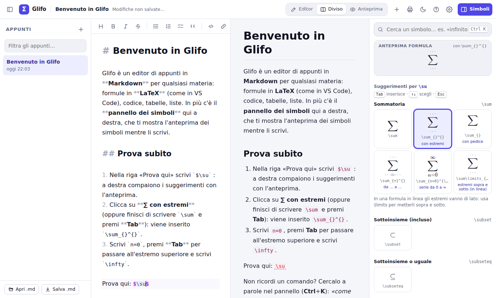

## Usarla tutti i giorni

Non serve installare nulla: basta aprire <https://diodialtro.github.io/Glifo/> dal
browser. Per averla come un'app vera, con la sua icona e funzionante anche senza internet:

| Dispositivo | Come installarla |
| --- | --- |
| Computer (Chrome o Edge) | icona **Installa** a destra nella barra degli indirizzi (oppure, nel menu del browser, la voce *Installa Glifo*) |
| Android (Chrome) | menu ⋮ → **Installa app** (o *Aggiungi a schermata Home*) |
| iPhone / iPad (Safari) | pulsante Condividi → **Aggiungi alla schermata Home** |
| Mac (Safari) | menu *File* → **Aggiungi al Dock** |

Cose da sapere:

- Senza account gli appunti sono salvati **nel browser del dispositivo** che stai usando:
  quelli scritti sul computer non compaiono da soli sul telefono. Con l'**account** sì
  (vedi sotto).
- Per spostarli o tenerli al sicuro puoi anche usare **Salva .md** (pure dentro una cartella
  di OneDrive, Google Drive o iCloud) e **Apri .md** sull'altro dispositivo. In *Impostazioni*
  c'è anche **Scarica backup**, con tutti gli appunti (e le loro lavagne) in un solo file.
  **Apri .md** apre anche i file di Excel (.xlsx) e .csv: diventano note con le tabelle.
- Puoi tenere Glifo aperto in più schede, o nell'app installata e nel browser insieme: si
  aggiornano a vicenda e nessuna cancella gli appunti scritti nelle altre.
- Quando esce una nuova versione, l'app si aggiorna da sola alla riapertura.

### Account

Con l'account ritrovi gli stessi appunti, con cartelle, impostazioni e dizionario personale,
su computer, tablet e telefono. Si entra da **Accedi**, in fondo alla barra laterale, senza
password: con **Continua con Google** oppure con un'email. Il link nell'email va aperto nel
browser in cui si usa Glifo; se si aprirebbe altrove (per esempio nell'app di Gmail), si copia
e si incolla nella finestra di Glifo. *Per ora è in prova: possono entrare solo gli indirizzi di
chi sta provando Glifo.*

- **Sincronizzazione automatica:** all'avvio, quando torni su Glifo, quando torna la rete e
  poco dopo ogni modifica. Il pallino sul pulsante dell'account dice com'è andata.
- **Senza rete** Glifo funziona come sempre, e le modifiche partono quando la rete torna.
- **Stessa nota cambiata su due dispositivi:** restano tutte e due le versioni, e quella
  di qui ha l'etichetta «copia in conflitto». Una nota eliminata su un dispositivo ma
  cambiata su un altro torna tra gli appunti: non si perde mai testo.
- **Primo accesso:** Glifo chiede se aggiungere all'account gli appunti già presenti nel
  browser. Se li lasci fuori, li ritrovi quando esci.
- **Chiave API:** quella dell'assistente AI resta sul dispositivo e non va all'account.
- **Uscita:** uscendo, le note dell'account vengono tolte dal browser, che magari non è il
  tuo. Nell'account restano. Le **lavagne** invece stanno solo nel browser: uscendo si tolgono
  anche loro, e prima Glifo lo dice.
- **Dove stanno i dati:** su [Supabase](https://supabase.com), in Europa (Francoforte).
  Ognuno può leggere solo i suoi appunti (vedi [supabase/README.md](supabase/README.md)).
- **I tuoi dati:** nella finestra dell'account, «Scarica i miei dati» scarica tutto l'account
  in un file (che «Ripristina backup» sa rileggere) ed «Elimina account» lo cancella dal
  server per sempre. Come vengono trattati i dati lo spiega
  l'[informativa sulla privacy](https://diodialtro.github.io/Glifo/privacy.html)
  (`privacy.html`).

#### Condividere una nota con un link

Il pulsante **Condividi** (l'icona in fondo alla barra laterale, accanto ad «Apri .md» e
«Salva .md») apre una finestra come quelle di Google (da lì si può anche stampare la nota o
salvarla in PDF). In «Accesso con il link» scegli **Chiunque abbia il link**: arriva il link,
da copiare con **Copia link** e mandare a chi vuoi. Serve l'account; chi riceve il link no.

- **È una fotografia,** come le conversazioni condivise di Gemini: chi apre il link vede la
  nota com'era quando l'hai condivisa, con formule, grafici e schemi, ma non può cambiarla.
  Se poi la nota cambia, la finestra lo dice e **Aggiorna il link** rifà la fotografia; il
  link resta lo stesso.
- **Consenti copie:** chi apre il link può salvarsene una copia tra i suoi appunti
  (**Salva una copia**). Togliendo la spunta, la nota si può solo leggere.
- **Togliere il link:** scegli **Con limitazioni**. Il link non si apre più; condividendo di
  nuovo la nota il link è un altro. Anche eliminando la nota, o l'account, il link smette di
  funzionare.
- Il link apre una pagina di Glifo (`nota.html`) che non mostra chi l'ha condivisa. Il codice
  nel link è casuale e non si indovina.

## Funzionalità

**Editor**
- Markdown completo: titoli, grassetto, corsivo, elenchi, liste di cose da fare, tabelle,
  citazioni, codice con evidenziazione, link, note a piè di pagina. E le **tabelle con le formule**,
  come Excel (vedi sotto).
- Formule in linea `$ … $` e a blocco `$$ … $$` riconosciute con **le stesse regole
  dell'anteprima di VS Code**: i file restano compatibili (anche i blocchi ` ```math ` di GitHub).
- Colori per il TeX dentro le formule, `$`, graffe e parentesi che si chiudono da sole.
- Barra di formattazione e scorciatoie (Ctrl+B, Ctrl+I, Ctrl+M per una formula…).
- **Elenchi di ogni tipo**, anche uno dentro l'altro: `1)` `1.` `(1)`, lettere `a)` `A)` `(a)`,
  numeri romani `i)` `ii)`, puntati `-` `*` `•`, etichette come `es)` `oss)` `NB)` e cose da
  fare `- [ ]`. **Invio** continua con il marcatore dopo (1) → 2), a) → b), i) → ii)) e su una
  riga vuota torna indietro di un livello; **Tab** sposta la riga dentro quella sopra, allineata
  al suo testo (1) → a) → i), come nei programmi di scrittura), **Maiusc+Tab** la riporta fuori;
  i numeri si aggiornano da soli. Nell'anteprima ogni marcatore si vede com'è scritto
  (`-` diventa un trattino). Tutti i tipi sono anche nel menu degli elenchi nella barra.
- **Controllo ortografico** in italiano e inglese con [Hunspell](https://hunspell.github.io), lo
  stesso correttore di LibreOffice e Firefox. Non controlla formule, codice e link, conosce i
  termini tecnici (iniettiva, jacobiano, bayesiano, eteroschedasticità…), i cognomi degli
  scienziati (Cauchy, Weierstrass, Schrödinger…) e le parole dell'informatica (array, thread,
  override…). Clic sulla parola sottolineata (o **Ctrl+.**) per le correzioni; le parole che
  aggiungi al tuo dizionario si possono rivedere in *Impostazioni*. Funziona anche offline.

**Pannello dei simboli**
- **Anteprima della formula** sotto il cursore, aggiornata mentre scrivi: mostra già il
  suggerimento selezionato al suo posto, e se c'è un errore lo spiega in italiano.
- **Suggerimenti** mentre scrivi `\…`, con varianti e segnaposto (`\frac{}{}`, `\lim_{ \to }`,
  matrici, sistemi…). Si può scrivere anche in italiano: `\infinito`, `\radice`, `\freccia`,
  `\perogni`.
- **Segnaposto annidati**: inserisci una frazione dentro l'estremo di una sommatoria e Tab
  passa prima dai campi della frazione, poi continua con quelli della sommatoria.
- Se **selezioni del testo** e clicchi `\sqrt{}`, il testo finisce dentro la radice.
- Se inserisci un simbolo **fuori da una formula**, i `$` vengono aggiunti da soli.
- **Ricerca a parole** (italiano e inglese), anche incollando il simbolo: `∞`, `ℝ`, `→`.
- **Catalogo per categorie**: lettere greche, frazioni e potenze, operatori, relazioni,
  frecce, insiemi, logica, analisi, funzioni, parentesi, accenti, stili, matrici e sistemi,
  testo e spazi, chimica (`\ce{H2O}`). Oltre 470 simboli, con più di 600 varianti.
- **Assistente AI** (facoltativo) per le domande difficili, es. «freccia con scritto sopra
  n → ∞»: risponde con il codice LaTeX pronto da inserire. Con la chiave di Anthropic, di Gemini
  (gratis), di OpenRouter, con Ollama sul tuo computer o con un altro servizio compatibile con OpenAI.
- **Spiegami** (in prova): con il cursore su un conto, i passaggi scritti da Qwen3, un modello AI
  che gira nel browser, con i conti fatti e controllati dal motore di Glifo (vedi «Spiegami»).

**Calcoli e grafici** (come le Note matematiche della Calcolatrice dell'iPad)
- Una formula che finisce con `=` mostra il **risultato**: nell'editor accanto all'uguale, più chiaro,
  e nell'anteprima colorato. Con il cursore subito dopo l'uguale **Tab** (o un clic) lo scrive nella
  formula; finché non lo si scrive non è nel testo, quindi cambia da solo se cambiano i numeri.
  Per una formula che finisce con l'uguale ma non vuole il risultato basta `={}`.
- Se il risultato lo scrivi tu (`$\int_0^1 x^2 \, dx = \frac{1}{3}$`), Glifo lo **controlla**: dopo la
  formula compare ✓ se è giusto, ✗ con il valore giusto se è sbagliato (nell'editor il ✗ aspetta che il
  cursore esca dalla formula, per non comparire a metà). Vale anche con le lettere
  (`$\int_{-R}^{R} \pi (R^2 - x^2) \, dx = \frac{4}{3} \pi R^3$`), con i decimali arrotondati o troncati
  (`$\sqrt{2} = 1{,}414$`), in ogni passaggio di una catena, anche con la primitiva tra gli estremi
  (`$\int_0^1 x^2 \, dx = \left[\frac{x^3}{3}\right]_0^1 = \frac{1}{3}$`), per le primitive
  (`$\int x^2 \, dx = \frac{x^3}{3} + c$`, controllata derivandola), le derivate, i limiti, le matrici,
  i numeri complessi e gli insiemi. Le definizioni (`$a = 2$`) e le equazioni (`$x^2 - 5x + 6 = 0$`) non
  si controllano; con `\approx` contano solo le cifre scritte. I segni non vanno nella stampa né nei
  file .md.
- Le formule si leggono dall'alto in basso: `$a = 2$` e `$f(x) = x^2 - a$` valgono per quelle sotto,
  e `$f(3) =$` dà 7. Anche `a := 2`, più definizioni in una formula (`$a = 2, \quad b = 3$`) e
  `$a = 3 + 4 =$` (mostra 7 e definisce a).
- I risultati come in un quaderno: frazioni esatte (`$\frac{1}{3} + \frac{1}{6} =$` dà ½), decimali
  con la virgola (`0{,}1 + 0{,}2` dà 0,3, non 0,30000000000000004), i puntini quando le cifre
  continuano (√2 = 1,414213…), le potenze di 10 per i numeri molto grandi o piccoli.
- Si calcolano le quattro operazioni, potenze e radici, `\sin`, `\cos`, `\tan` e le inverse,
  `\ln`, `\log` (naturale, come in Analisi; `\log_{10}` e `\lg` per la base 10), `\exp`, valore
  assoluto, parte intera, fattoriale, `\binom`, percentuali, gradi (`30^\circ`), somme e prodotti
  (`\sum_{k=1}^{10} k^2`), integrali definiti (`\int_0^1 x^2 \, dx`, anche con ±∞), derivate delle
  funzioni definite (`f'(2)`, `f''(2)`) e funzioni a tratti con `\begin{cases}`. Si scrivono in LaTeX
  ma anche come in una calcolatrice: `sqrt(x)`, `sin(x)`, `2*x`, `pi`; e con i nomi italiani (`\tg`,
  `\arctg`, `\operatorname{sen}`, `settsinh`).
- **Numeri complessi** con la `i`: `$(1 + 2i)(3 - i) =$` dà 5 + 5i, `$\frac{1}{1 + i} =$` dà ½ − ½i (con
  le frazioni i conti restano esatti), `$e^{i\pi} =$` dà −1. Modulo `|z|`, argomento `\arg z` (tra −π e
  π, scritto come multiplo di π quando lo è), parte reale e immaginaria (`\Re z`, `\Im z`, anche
  `\operatorname{Re}`), coniugato (`\bar{z}`, `\overline{1 + i}`), potenze, esponenziale, logaritmo e
  funzioni trigonometriche. Una radice da sola dà **tutte le radici** (`$\sqrt[3]{8i} =$` dà le tre
  radici cubiche); dentro un'espressione vale la principale. Un numero definito (`$z = 1 + 2i$`) e le
  funzioni (`$f(z) = z^2 + 1$`) si usano dopo; una formula senza valore reale (`\sqrt{-4}`, `\ln(-1)`)
  ha il suo valore complesso.
- **Vettori e matrici**: le matrici con `\begin{pmatrix} 2 & 1 \\ 1 & 2 \end{pmatrix}` (anche `bmatrix`;
  `vmatrix` è il determinante), i vettori come `(1, 2, 3)` o in colonna. Somme e prodotti (`A B`, `2A`,
  `A v`), trasposta (`A^T`, `A^\top`), inversa (`A^{-1}`, con le frazioni esatte), potenze, determinante
  (`\det A`, `|A|`), rango (`\operatorname{rank}`, `\operatorname{rg}`), traccia (`\operatorname{tr}`),
  riduzione a scala (`\operatorname{rref}`), nucleo e immagine (`\ker A`, `\operatorname{Im} A`, come span
  di una base, e `\dim \ker A`), prodotto scalare (`u \cdot v`, `\langle u, v \rangle`) e vettoriale
  (`u \times v`), norma (`\|v\|`), **autovalori** e **autovettori** (`\operatorname{autovalori}(A) =`,
  `\operatorname{autovettori}(A) =`, anche complessi e con la molteplicità) e il polinomio caratteristico
  (`\det(A - \lambda I) =`). I risultati con le matrici si vedono disegnati anche nell'editor.
- **Sistemi lineari e algebra lineare**: `A x = b \Rightarrow` con la matrice (Rouché–Capelli: `x = (−4, 9/2)`,
  infinite soluzioni con i parametri, `x = (1, 0, 0) + t(−2, 1, 0) + s(−3, 0, 1)`, o nessuna, con i ranghi di A e
  di (A|b)); i **sistemi con un parametro** discussi al variare del parametro
  (`\begin{cases} x + k y = 1 \\ k x + y = 1 \end{cases} \Rightarrow` dà la soluzione per k ≠ ±1 e i casi
  k = 1 e k = −1; le incognite sono x, y, z, w, t, il parametro l'altra lettera), anche con la matrice
  (`$A = \begin{pmatrix} 1 & k \\ 2 & 4 \end{pmatrix}$`, poi `\operatorname{rank}(A) =` dà «2 per k ≠ 2; 1 per
  k = 2», `\det A =`, `A x = b \Rightarrow`). `\operatorname{diagonalizza}(A) =` dà P e D (con A simmetrica
  anche P ortogonale, con le radici esatte), o perché non si può (autovalori complessi, o la molteplicità
  geometrica più piccola dell'algebrica). `\operatorname{gramschmidt}(u, v, w) =` dà i vettori ortogonali e
  quelli ortonormali; `\operatorname{indipendenti}(u, v, w) =` dice se lo sono (o la relazione: 2u − v = 0).
  I **sottospazi**: `U + W`, `U \cap W`, `U^\perp`, `\dim(U \cap W)`, `\operatorname{equazioni}(U) =` (le
  equazioni cartesiane: x + y − z = 0), `\operatorname{proiezione}(v, U) =`. Le **forme quadratiche**
  (`$q(x, y) = x^2 + 4xy + y^2$`): `\operatorname{matrice}(q) =` e `\operatorname{segnatura}(q) =` (definita,
  semidefinita o indefinita, con n₊, n₋, n₀; anche di una matrice simmetrica). Le **applicazioni lineari**
  (`$f(x, y, z) = (x + y, y - z)$`): `\operatorname{matrice}(f) =`, `\ker f =`, `\operatorname{Im} f =`.
- **Geometria**, con i punti scritti prima (`$A = (0, 0)$`, `$B = (4, 0)$`, anche con tre coordinate):
  lunghezze (`\overline{AB} =`, `d(A, B) =`, con le radici esatte: √2 ≈ 1,414213…), il vettore da A a B
  (`\overrightarrow{AB}`, `\vec{AB}`), punto medio e baricentro (`\operatorname{medio}(A, B)`,
  `\operatorname{baricentro}(A, B, C)`), la retta per due punti (`\operatorname{retta}(A, B) =` dà
  `y = 2x`; anche `\overleftrightarrow{AB}`; nello spazio in forma parametrica), triangoli e poligoni con
  area e perimetro (`\triangle ABC =`, `\operatorname{area}(A, B, C)`, `\operatorname{poligono}(A, B, C, D)`,
  `\operatorname{perimetro}(\triangle ABC)`), angoli in gradi (`\widehat{BAC} =`, `\angle ABC`, e
  `\operatorname{angolo}(u, v)` tra due vettori), circonferenze con centro e raggio o per tre punti
  (`\operatorname{circonferenza}(O, 3) =` dà `(x − 1)² + (y − 2)² = 9`), il piano per tre punti
  (`\operatorname{piano}(A, B, C) =`), le distanze di un punto da una retta e da un piano (`d(P, r) =`) e
  le intersezioni di rette, circonferenze e piani (`\operatorname{intersezione}(r, c) =`, con le radici
  esatte: `(−√2, −√2); (√2, √2)`). Le figure con un nome (`r = \operatorname{retta}(A, B)`) si usano dopo.
- **Derivate scritte come formula**: con `$f(x) = \frac{x^2 - 1}{x + 2}$`, `$f'(x) =$` dà
  `(x² + 4x + 1)/(x + 2)²` (le frazioni con un denominatore solo, i polinomi dal grado più alto, i fattori
  comuni raccolti: `(1 − x)e^{−x}`); anche `f''(x)`, `\frac{d}{dx} \sin x \cos x =`, `\frac{d^2}{dx^2}`, la
  funzione integrale (`F(x) = \int_0^x e^{-t^2} \, dt` dà `F'(x) = e^{−x²}`) e, in un punto, `f'(2) =`. Le
  **derivate parziali** si scrivono `\frac{\partial f}{\partial x}`, `\frac{\partial^2 f}{\partial x \partial y}`,
  `\partial_x f`, anche in un punto (`\frac{\partial f}{\partial x}(1, 2) =`). Con i campi: il **gradiente**
  (`\nabla f`, `\operatorname{grad} f`), la **divergenza** (`\nabla \cdot F`, `\operatorname{div} F`), il **rotore**
  (`\nabla \times F`, `\operatorname{rot} F`; nel piano è un numero), il laplaciano (`\nabla^2 f`), l'hessiana
  (`\operatorname{Hess} f`, anche `\det \operatorname{Hess} f(1, 1) =`) e la jacobiana (`\operatorname{jac} F`).
  I risultati con le lettere si vedono disegnati anche nell'editor; Tab li scrive nella formula.
- **Campi, curve e superfici** con il nome: `$F(x, y) = (-y, x)$`, `$\gamma(t) = (\cos t, \sin t), \; t \in [0, 2\pi]$`
  (l'intervallo del parametro dopo la virgola), `$S(u, v) = (…), \; u \in [0, 2\pi], \; v \in [0, \pi]$`;
  `F(1, 2) =` dà il vettore. Gli **integrali di linea**: di una funzione (`\int_\gamma f \, ds`, con `1` la
  lunghezza), di un campo (il lavoro: `\oint_\gamma F \cdot dr`, anche `\int_\gamma \nabla f \cdot dr`) o di una
  forma (`\oint_\gamma (-y \, dx + x \, dy)`). Gli **integrali di superficie**: `\iint_S f \, dS` (con `1` l'area)
  e il flusso `\iint_S F \cdot d\mathbf{S}` (o `F \cdot n \, dS`), con la normale S_u × S_v; su una superficie chiusa
  (`\oiint_S`) sempre verso fuori.
- **Limiti**: `\lim_{x \to 0} \frac{\sin x}{x} =` dà 1, anche da una parte sola (`x \to 0^+`, `x \to 0^-`) e
  all'infinito (`x \to +\infty`). Le forme 0/0 si fanno con le derivate esatte (de l'Hôpital:
  `\frac{\tan x - x}{x^3}` dà 1/3), le altre con i numeri, e il valore si riconosce quando è una frazione, una
  radice o un multiplo di π, π², e, ln 2 (`(1 + \frac{1}{x})^x` dà e ≈ 2,718281…). Se va all'infinito il
  risultato è +∞ o −∞; se non c'è, «non esiste», con i due valori quando da sinistra e da destra vengono
  diversi (`\frac{|x|}{x}`). Con n (o k, m) che va all'infinito è una successione:
  `\lim_{n \to \infty} \frac{n!}{n^n} =` dà 0, `(-1)^n` non ha limite.
- **Serie** fino a ∞: `\sum_{n=1}^{\infty} \frac{1}{n^2} =` dà π²/6 ≈ 1,644934…, `\frac{(-1)^{n+1}}{n}` dà ln 2,
  `\frac{1}{n!}` (da 0) dà e; quelle che divergono +∞ (`\frac{1}{n}`), quelle che oscillano «non esiste».
- **Polinomi di Taylor**: `\operatorname{taylor}(\sin x, 0, 5) =` dà x − x³/6 + x⁵/120 (dalla potenza più
  bassa, come nei libri), anche in un altro punto (`\operatorname{taylor}(\ln x, 1, 3)`) e delle funzioni
  della nota; `\operatorname{maclaurin}(\cos x, 4)` è quello in 0. Con un nome
  (`T(x) = \operatorname{taylor}(\sin x, 0, 3)`) si usa dopo, anche nei grafici.
- **Primitive** (integrali indefiniti): `\int x e^x \, dx =` dà (x − 1)eˣ + c, come a lezione: gli integrali
  immediati, per sostituzione (`\int x e^{x^2} \, dx`, `\int \frac{\ln x}{x} \, dx`, anche `\int \sin(\ln x) \, dx`),
  per parti (`x^2 \cos x`, `\ln x`, `\arctan x`, `e^x \sin x`), le funzioni razionali con i fratti semplici
  (`\frac{1}{x^2 - 1}` dà ½ ln|(x − 1)/(x + 1)|), le potenze di seno e coseno (`\sin^4 x`), le radici
  (`\sqrt{1 - x^2}`, `x \sqrt{x + 1}`), anche con il dx nella frazione (`\int \frac{dx}{1 + x^2}`) e con le
  lettere nei coefficienti, che sono numeri positivi (`\int \frac{dx}{x^2 + a^2}` dà arctan(x/a)/a,
  `\int \sqrt{R^2 - x^2} \, dx` dà x√(R² − x²)/2 + (R²/2) arcsin(x/R)). Ogni
  primitiva si controlla derivandola; quelle che non si scrivono con le funzioni elementari (`e^{-x^2}`,
  `\frac{\sin x}{x}`) non hanno risultato. La costante è c (k se la c c'è già); con un nome
  (`F(x) = \int x e^x \, dx`) la primitiva si usa dopo, anche nei grafici.
- **Integrali definiti esatti**: con la primitiva il valore esatto (`\int_0^1 \frac{dx}{1 + x^2} =` dà
  π/4 ≈ 0,785398…, `\int_0^1 \arctan x \, dx` dà π/4 − ln(2)/2), anche **impropri** (`\int_1^{\infty} \frac{dx}{x^2} =`
  dà 1, `\int_0^1 \frac{dx}{x}` dà +∞: diverge). Anche **con le lettere**, che sono numeri positivi (un
  raggio, un'altezza): il volume della sfera scritto come sul quaderno (`\int_{-R}^{R} \pi (R^2 - x^2) \, dx =`
  dà 4πR³/3), l'area del cerchio (`\int_{-R}^{R} 2 \sqrt{R^2 - x^2} \, dx` dà πR²), gli impropri
  (`\int_0^{\infty} t \lambda e^{-\lambda t} \, dt` dà 1/λ), il valor medio (`\frac{1}{b - a} \int_a^b x^2 \, dx`
  dà (a² + ab + b²)/3) e la funzione integrale (`\int_0^x t^2 \, dt =` dà x³/3); anche dentro un'espressione
  (`2 \int_0^R …`, `\int_0^1 x \, dx + \int_0^1 x^2 \, dx` dà 5/6). Ogni risultato con le lettere si controlla
  con i numeri, con tre scelte di valori: se non torna non c'è (`\int_{-a}^{a} \frac{dx}{x^2}` diverge, e
  `\int_1^{\infty} \frac{dx}{x^p}` dipende da p). Se la primitiva non si trova resta il valore con i numeri.
- **Studio di funzione**: `\operatorname{studio}(f) =` (con f definita prima, o la funzione stessa:
  `\operatorname{studio}(x e^{-x}) =`) fa lo studio come a lezione, una parte per riga: dominio, simmetria
  (pari o dispari), periodo, intersezioni con gli assi, segno, limiti agli estremi del dominio, asintoti
  (verticali, orizzontali e obliqui), la derivata con la crescenza e i massimi e minimi (anche i punti
  angolosi e le cuspidi), la derivata seconda con la concavità e i flessi (anche a tangente orizzontale o verticale). I
  punti sono esatti quando si può (massimo (1; e⁻¹)); le funzioni periodiche si studiano in un periodo
  (`\tan x` in [0, π], con x ≠ π/2 + kπ). Una parte sola: `\operatorname{dominio}(\ln(4 - x^2)) =` dà
  −2 < x < 2, e così `\operatorname{asintoti}`, `\operatorname{estremi}`, `\operatorname{flessi}`,
  `\operatorname{zeri}`.
- **Analisi in più variabili**: i **limiti** `\lim_{(x, y) \to (0, 0)} \frac{x y}{x^2 + y^2} =` (lungo le rette
  e le parabole per il punto: «non esiste (lungo y = 0 vale 0, lungo y = x vale 1/2)»; se i cammini danno lo
  stesso valore, si controlla tutto attorno al punto, come in coordinate polari); i **punti critici** con
  la loro natura dall'hessiana: `\operatorname{critici}(x^3 + y^3 - 3xy) =` (o `\nabla f = 0 \Rightarrow`) dà
  (0, 0) punto di sella; (1, 1) minimo relativo, f = −1 (anche in tre variabili, i casi dubbi e gli infiniti
  punti critici); i **massimi e minimi vincolati** con i moltiplicatori di Lagrange
  (`\operatorname{lagrange}(x + y, x^2 + y^2 = 1) =`, `\max_{x^2 + y^2 = 1} (x + y) =`) e **assoluti** su un
  insieme chiuso e limitato, dentro, sul bordo e negli spigoli (`\operatorname{estremi}(f, x^2 + y^2 \le 1) =`,
  `\max_{x \ge 0, y \ge 0, x + y \le 1} x y =`, o con un insieme D della nota); il **polinomio di Taylor** in
  più variabili (`\operatorname{taylor}(e^{x + y}, (0, 0), 2) =`). I punti si trovano con i numeri e si
  riconoscono esatti (frazioni, radici, multipli di π) controllandoli con le lettere.
- **Coniche e quadriche**: `\operatorname{conica}(4x^2 + 9y^2 - 8x - 36y + 4 = 0) =` dà il tipo, la forma
  canonica ((x − 1)²/9 + (y − 2)²/4 = 1) e gli elementi: centro, semiassi, fuochi (1 ± √5, 2) ed
  eccentricità per l'ellisse; raggio per la circonferenza; fuochi e asintoti per l'iperbole; vertice,
  fuoco, direttrice e asse per la parabola; le degeneri (due rette, un punto) e quelle senza punti reali.
  Con il termine in xy la forma canonica negli assi ruotati (con l'angolo). `\operatorname{quadrica}(…) =`
  dà ellissoide (e sfera, con centro e raggio), iperboloide a una o a due falde, paraboloide ellittico o
  iperbolico, cono, cilindri, con la forma canonica.
- **Serie di potenze**: con una lettera libera, `\sum_{n=1}^{\infty} \frac{x^n}{n} =` dà il raggio di
  convergenza (criterio del rapporto o della radice, anche con n! e nⁿ: R = 1/e) e l'insieme di convergenza
  con gli estremi provati uno per uno (R = 1; converge per x ∈ [−1, 1)).
- **Serie di Fourier**: `\operatorname{fourier}(x^2) =` dà a₀, aₙ, bₙ esatti (con n come lettera:
  4(−1)ⁿ/n²), dice se la funzione è pari o dispari (tolta la costante a₀/2; su intervalli come [0, 2π] lo dice
  del prolungamento periodico) e scrive la serie; su [−π, π] o su un intervallo
  (`\operatorname{fourier}(f, [-1, 1])`, o con il periodo), anche per le funzioni a tratti e con |x|; i
  coefficienti dove la formula non vale a parte (x sin x: a₁). Nel grafico
  `\operatorname{fourier}(f, [-\pi, \pi], N)` disegna la funzione ripetuta e la somma con N termini (con
  `N = 5` nel blocco, lo slider).
- **Trasformata di Laplace**: `\mathcal{L}\{t e^{-t}\} =` (1/(s + 1)²) con la tabella (potenze, esponenziali,
  seni e coseni anche moltiplicati, sinh e cosh, con le lettere come e^{at}), e l'antitrasformata
  `\mathcal{L}^{-1}\{\frac{s + 3}{s^2 + 2s + 5}\} =` con i fratti semplici; tutte e due controllate con
  l'integrale fatto con i numeri.
- **Statistica inferenziale**: gli intervalli di confidenza della media (`\operatorname{ic}(x, 0{,}95) =` con i dati,
  o `\operatorname{ic}(\bar{x} = 12, s = 2, n = 25, 0{,}95)`; con la t, o con la z se c'è σ), di una proporzione
  (con `\hat{p}`) e della varianza (`\operatorname{icvarianza}`); i test d'ipotesi con l'ipotesi alternativa
  scritta come relazione: `\operatorname{test}(x, \mu > 10) =` (t o z), su una proporzione
  (`p > 0{,}5`), sulla varianza con il χ² (`\sigma^2 > 4`), due medie con Welch (`\operatorname{test}(x, y)`),
  il χ² di adattamento e di indipendenza (`\operatorname{chiquadro}(o, e)`, o una tabella); con la statistica,
  il p-value, la regione di rifiuto e la decisione al livello α (0,05 se non è scritto). Nel pannello e nei
  grafici la densità con la regione di rifiuto colorata e la statistica tratteggiata.
- **Calcolo numerico**, con la tabella dei passi: gli zeri con la bisezione
  (`\operatorname{bisezione}(x^3 - x - 2, [1, 2]) =`, anche con la tolleranza), Newton (con la derivata fatta
  con le lettere; anche `\operatorname{newton}(x^2 = 2, 1)`), le secanti e il punto fisso (con |g′(x*)|);
  il polinomio interpolante (`\operatorname{interpola}((0, 1), (1, 3), (2, 2)) =`, esatto) e quello dei minimi
  quadrati (con il grado e la somma dei quadrati dei residui); trapezi, Simpson e rettangoli con l'errore;
  la fattorizzazione LU (PA = LU quando serve un pivot) e Cholesky; le norme 1, 2, ∞, di Frobenius e il
  numero di condizionamento; Jacobi e Gauss–Seidel con il raggio spettrale e la diagonale dominante;
  Eulero, Heun e Runge–Kutta 4 per y′ = f(x, y) con l'errore. Con il cursore sulla formula, nel pannello
  il disegno: lo zero sulla curva, i dati con il polinomio, i passi di Eulero con la soluzione.
- **Aritmetica**: `\operatorname{fattori}(360) =` (2³ · 3² · 5), `\operatorname{divisori}(12) =`,
  `\operatorname{primo}(97) =` (anche grandi), il resto `17 \bmod 5 =` (anche `3^{1000} \bmod 7` e
  `3^{-1} \bmod 7`), `\operatorname{divisione}(17, 5) =` (17 = 5 · 3 + 2), l'algoritmo di Euclide passo per
  passo (`\operatorname{euclide}(252, 198) =`), Bézout, l'inverso modulo n (`\operatorname{inverso}(3, 7) =`),
  la funzione di Eulero (`\varphi(12) =`), le equazioni diofantee (`\operatorname{diofantea}(3x + 5y = 7) =`:
  x = 4 + 5k, y = −1 − 3k). Le **congruenze** con ⇒: `3x \equiv 2 \pmod{5} \Rightarrow` (x ≡ 4 (mod 5)),
  i sistemi con il teorema cinese del resto (anche con i moduli non primi tra loro), quelle di grado più
  alto provando i resti. Le **basi**: `(1011)_2` nelle formule vale 11, `\operatorname{binario}(11) =`,
  `\operatorname{esadecimale}(255) =`, `\operatorname{base}(100, 3) =`.
- **Polinomi**: `\operatorname{scomponi}(…) =` scompone in fattori: con una lettera con le frazioni
  (x(x − 1)(x + 1), (2x − 1)(3x − 1), (x³ − 2)(x³ − 3); «irriducibile in ℚ» se non si può), con più lettere
  il raccoglimento e i prodotti notevoli ((a − b)(a + b), (x + y)², 2a(x + 2y)). `\operatorname{sviluppa}(…) =`,
  la divisione con il resto (`\operatorname{divisione}(P, D) =`: quoziente e resto), la **regola di Ruffini**
  con la tabella (`\operatorname{ruffini}(x^3 - 2x + 1, x - 1) =`), mcd e mcm di polinomi.
- **Insiemi** scritti elemento per elemento (`A = \{1, 2, 3\}`, anche `\{1, 2, \ldots, 10\}`): `A \cup B`,
  `A \cap B`, `A \setminus B`, la differenza simmetrica `A \triangle B`, il prodotto cartesiano `A \times B`
  (e `A^2`), l'insieme delle parti `\mathcal{P}(A)` (o `2^A`), il complementare `A^c` o `\overline{A}`
  rispetto a U, quanti elementi `|A|` (o `\#A`); con lo spazio Ω la probabilità classica `P(A) =` |A|/|Ω|, anche
  `P(A \mid B)`. Gli insiemi che vengono dalle operazioni si usano dopo (`C = A \cup B`).
- **Logica**: una formula con i connettivi e «=» (`p \land q \Rightarrow p =`), o
  `\operatorname{verità}(…) =`, fa la **tavola di verità** con la colonna di ogni sottoformula (dalla riga
  con tutto vero) e dice se è una tautologia (le due formule sono equivalenti, la conclusione segue dalle
  premesse), una contraddizione, o in quanti casi è vera. Connettivi: ¬ ∧ ∨ ⊕ ⇒ ⇔, NAND (↑) e NOR (↓), ⊤ e ⊥;
  anche come nell'algebra di Boole (`A + B\overline{C}`). `\operatorname{fnd}(…)` e `\operatorname{fnc}(…)`
  danno le forme normali canoniche.
- **Variabili aleatorie**: `$X \sim B(10, 0{,}3)$` definisce X (anche `B(10; 0,3)`, `\operatorname{Bin}`):
  binomiale, `\operatorname{Be}(p)` di Bernoulli, `\operatorname{Po}(\lambda)` di Poisson, `\operatorname{Geom}(p)`
  geometrica (le prove fino al primo successo: 1, 2, 3…), `\operatorname{H}(N, K, n)` ipergeometrica (N oggetti,
  K «buoni», n estratti), `N(\mu, \sigma^2)` normale (anche `\mathcal{N}`, con la varianza), `\operatorname{Exp}(\lambda)`,
  `U(a, b)` uniforme, `t(n)` (o `t_{10}`) di Student, `\chi^2(n)`, `F(m, n)` di Fisher, `\Gamma(\alpha, \lambda)`. Poi
  `P(X = 3) =`, `P(X \le 3) =`, `P(2 < X \le 5) =`, `P(|X - 5| < 2) =`, la probabilità condizionata
  `P(X > 3 \mid X > 1) =` (anche `\Pr`, `\mathbb{P}`), `E[X] =` (anche `E(X)`, `\mathbb{E}[X]`, `E[X^2]`,
  `E[2X + 1]`), `\operatorname{Var}(X) =`, `\operatorname{sqm}(X) =`, `\operatorname{quantile}(X, 0{,}95) =`.
  Le probabilità sono esatte quando si può: 25/72 ≈ 0,347222…, con Poisson (9e⁻³)/2 ≈ 0,224041…, con
  l'esponenziale 1 − e⁻² ≈ 0,864664…; la normale, la t e il χ² con le cifre. `\Phi(1{,}96) =` è la
  normale standard e `\Phi^{-1}(0{,}975) =` il suo quantile; `P(X \le q) = 0{,}95 \Rightarrow` trova q.
- **Calcolo combinatorio**: `n!`, `\binom{n}{k}`, le combinazioni `C_{10,3}` e le disposizioni `D_{10,3}`,
  con ripetizione `C'_{10,3}` e `D'_{10,3}`, come nei libri italiani.
- **Statistica dei dati**: i dati in un vettore (`$x = (2, 3, 5, 7, 7, 9)$`, con i decimali
  `(1{,}5; 2{,}3; 4)`), o uno per uno. `\operatorname{media}(x) =` (o `\bar{x} =`), `\operatorname{mediana}`,
  `\operatorname{moda}` (anche più di una, o nessuna), `\operatorname{Var}` e `\operatorname{sqm}` (dividendo per n;
  quelle campionarie, per n − 1, sono `\operatorname{varc}` e `\operatorname{sqmc}`), `\operatorname{quartili}`,
  `\operatorname{quantile}(x, 0{,}9)` e `\operatorname{percentile}(x, 90)` (come QUARTILE.INC di Excel),
  `\operatorname{campo}`, `\min`, `\max`; con le frequenze in un secondo vettore `\operatorname{media}(v, f)`.
  `\operatorname{frequenze}(x) =` dà la tabella (assolute, relative, cumulate), `\operatorname{statistiche}(x) =`
  tutto insieme. Con due serie `\operatorname{Cov}(x, y)`, `\operatorname{corr}(x, y)` e
  `\operatorname{regressione}(x, y) =`: y = 0,6x + 2,2 (r = 0,774596…).
- **Equazioni, disequazioni e sistemi risolti**: con `\Rightarrow` (o `\implies`, ⇒) in fondo.
  `x^2 - 5x + 6 = 0 \Rightarrow` dà x = 2 ∨ x = 3, `x^2 - x - 1 = 0` dà x = (1 ± √5)/2, `x^2 - 4x + 4 = 0`
  x = 2 (doppia); senza soluzioni reali dice quelle complesse. Le goniometriche con il periodo
  (`\sin x = \frac{1}{2}` dà x = π/6 + 2kπ ∨ x = 5π/6 + 2kπ), le esponenziali e le logaritmiche con il valore
  esatto (`e^x = 2` dà x = ln 2), le altre con i numeri (`\cos x = x`). Le **disequazioni** danno gli
  intervalli (`\frac{x - 1}{x + 2} \ge 0 \Rightarrow` dà x < −2 ∨ x ≥ 1; `(x - 1)^2 > 0` dà x ≠ 1). I
  **sistemi** con le virgole o in `\begin{cases}`: lineari, con le frazioni esatte (anche con infinite
  soluzioni, «y qualsiasi», o impossibili), e non lineari
  (`\begin{cases} x^2 + y^2 = 25 \\ x - y = 1 \end{cases}` dà (x, y) = (−3, −4) ∨ (x, y) = (4, 3)).
- **Equazioni differenziali**: `$y' = x - y, \; y(0) = 1$` fa di y la soluzione (calcolata con i numeri,
  con Runge–Kutta): dopo, `$y(2) =$` dà 1,270670…, e y si usa come le altre funzioni (derivate,
  integrali, grafici). Anche di ordine più alto, con le condizioni su y', y'' nello stesso punto
  (`y'' + 2y' + 5y = 0, \; y(0) = 1, \; y'(0) = 0`), scritte in qualsiasi modo se la derivata più alta è al
  primo grado; con x come funzione la variabile è il tempo t (`x'' = -x`). Le derivate si scrivono anche
  `\frac{dy}{dx}`, `\dot{x}`, `\ddot{x}` o `y'(x)`.
- **Equazioni differenziali con la formula**: con `\Rightarrow` in fondo, l'integrale generale come a
  lezione. Lineari a coefficienti costanti con le radici del polinomio caratteristico
  (`y'' + 2y' + 5y = 0 \Rightarrow` dà y = e^{−x}(c₁ cos 2x + c₂ sin 2x)) e la soluzione particolare con il
  **metodo di somiglianza**, anche in risonanza (`y'' + y = \sin x` dà … − (x cos x)/2), o con la
  **variazione delle costanti** (`y'' + y = \tan x`); anche con i parametri (`y'' + \omega^2 y = 0`,
  `m x'' + k x = 0`). Lineari del primo ordine con il fattore integrante (`y' + \frac{y}{x} = x^2`), a
  **variabili separabili** (`y' = y(1 - y)` dà y = 1/(1 + c e^{−x}), e la soluzione costante y = 0 che la
  formula non dà; `y' = \frac{x}{y}` dà y = ±√(x² + c); se y non si ricava, la forma implicita), di
  **Bernoulli**, di **Eulero** (`x^2 y'' + x y' - y = 0`) e senza la y (`x y'' + y' = 0`). Con le
  condizioni dopo l'equazione è il **problema di Cauchy** (`y'' + y = 0, \; y(0) = 1, \; y'(0) = 0 \Rightarrow`
  dà y = cos x), con le condizioni in due punti il **problema ai limiti** (una soluzione, nessuna o infinite:
  `y(0) = 0, \; y(\pi) = 0` dà y = c sin x). I **sistemi** lineari di due equazioni
  (`x' = y, \; y' = -x \Rightarrow`, anche in `\begin{cases}`, con il termine noto e le condizioni). Ogni
  soluzione si controlla con i numeri prima di mostrarla.
- **Integrali doppi e tripli**, con il dominio sotto: disuguaglianze (`\iint_{x^2 + y^2 \le 1} (x^2 + y^2) \, dA =`,
  `\iiint_{x^2 + y^2 \le 1, 0 \le z \le 2} dV =`), rettangoli (`\iint_{[0, 1] \times [0, 2]} x y \, dx \, dy =`,
  `[0, 1]^3`) o il nome di un insieme scritto prima (`$D = \{(x, y) : 0 \le y \le x \le 1\}$` e poi
  `\iint_D x y \, dA =`); oppure uno dentro l'altro con gli estremi (`\int_0^1 \int_0^x x y \, dy \, dx =` dà
  1/8), anche in coordinate polari (`\int_0^{2\pi} \int_0^1 r \, dr \, d\theta` dà π) e sferiche: questi sono
  esatti con le primitive, anche con le lettere (`\int_0^{2\pi} \int_0^{\pi} \int_0^R \rho^2 \sin\varphi \, d\rho \, d\varphi \, d\theta =`
  dà 4πR³/3, e così in coordinate cilindriche e cartesiane). I differenziali sono `dx \, dy`, `dA`, `dV` o
  `d(x, y)`. Con il dominio sotto, o se le primitive non si trovano, il risultato è con i numeri e ha qualche
  cifra in meno degli integrali semplici (sono quelle sicure).
- Il pulsante con gli **assi** nella barra mette nella nota un **grafico**: con il cursore su una
  funzione (`$f(x) = …$`) disegna quella, su un integrale (`$\int_0^2 x^2 \, dx =$`) la sua area (e
  così le curve di livello, i polinomi di Taylor, le primitive, gli studi di funzione, le distribuzioni e le
  probabilità, le equazioni differenziali), se no prepara il blocco
  da scrivere. Il grafico della formula sotto il cursore si vede anche nel
  pannello a destra, con «Inserisci il grafico».
- Il blocco ` ```grafico ` ha una riga per ogni cosa da disegnare: funzioni (`y = x^2`, `f(x) = \frac{1}{x}`,
  o solo `x^2`), anche dove vale una condizione (`y = \sqrt{x}, 0 \le x \le 4`), rette verticali
  (`x = 2`), curve qualsiasi (`x^2 + y^2 = 4`), in coordinate polari (`r = 1 + \cos\theta`) o con un
  parametro (`(\cos t, \sin t)`), punti (`P = (1, 2)`, anche `(0,5; 2)`), numeri da usare
  (`a = 2`) e la parte da mostrare (`x \in [-5, 5]`, `-1 \le y \le 3`). Usa anche le definizioni della
  nota scritte prima; `%` comincia un commento.
- Un **integrale** definito nel blocco (`\int_0^2 x^2 \, dx`, anche `\int_0^2 f(x) \, dx`, fino a
  `\infty`, o con un nome: `A = \int_0^2 x^2 \, dx`) colora l'**area** tra la curva e l'asse x, da un
  estremo all'altro, e la legenda dice quanto vale (`= 2,666666…`). Le parti sotto l'asse contano con
  il meno, come nell'integrale. Se la curva è già nel grafico (`y = x^2` o `f(x) = x^2` in un'altra
  riga) l'area prende il suo colore; se no il grafico disegna anche la curva. Gli estremi possono
  essere numeri con lo slider (`\int_0^b`): muovendolo l'area cambia. Si può lasciare l'uguale
  finale o il risultato copiato dalla nota.
- **Probabilità e statistica** nel blocco: `X \sim B(10, 0{,}3)` disegna le probabilità dei valori come
  barre (una continua, `Z \sim N(0, 1)`, la sua densità); `P(X \le 3)` colora le barre dei valori dell'evento,
  `P(-1 \le Z \le 1)` l'area sotto la densità, con il valore nella legenda (se nessuna riga disegna la
  distribuzione, la disegna anche lei). `y = P(X \le x)` è la funzione di ripartizione. Con i dati:
  `\operatorname{istogramma}(x)` (le classi le sceglie da solo; `\operatorname{istogramma}(x, 5)` con 5 classi,
  `\operatorname{istogramma}(x, (0, 10, 20, 50))` con quegli estremi e l'altezza come densità),
  `\operatorname{barre}(x)` (quante volte c'è ogni valore; `\operatorname{barre}(v, f)` con le frequenze),
  `\operatorname{dispersione}(x, y)` e `\operatorname{regressione}(x, y)`, i punti con la retta.
- Uno **studio di funzione** nel blocco (`\operatorname{studio}(f)`, anche dopo `f(x) = …` in un'altra riga)
  disegna la funzione con gli **asintoti tratteggiati** e i punti notevoli con il nome: i massimi M, i
  minimi m e i flessi F (M₁, M₂… se sono più di uno); `\operatorname{asintoti}(f)` solo gli asintoti,
  `\operatorname{estremi}(f)`, `\operatorname{flessi}(f)` e `\operatorname{zeri}(f)` solo quei punti.
- Le **disuguaglianze** colorano una **zona**: `y > x^2`, `x^2 + y^2 \le 4`, `y \le 4 - x^2, y \ge 0`; il
  bordo è tratteggiato dove non ne fa parte (con < e >). Anche gli **insiemi**
  (`D = \{(x, y) : 0 \le x \le 1, x^2 \le y \le x\}`, o il nome di uno della nota) e i **domini degli
  integrali doppi**, con il valore nella legenda (`\iint_D 1 \, dA = 0,166666…`; scritto in r e θ, il
  dominio si disegna dove sta nel piano). Con la z sono **solidi**: `x^2 + y^2 + z^2 \le 1`, gli insiemi con
  tre variabili, il dominio di un integrale triplo (anche in coordinate cilindriche e sferiche), e un
  integrale doppio con una funzione di x e y diventa il **volume sotto la superficie** (sotto lo zero
  dove la funzione è negativa). Gli spigoli restano netti: ogni condizione disegna la sua faccia.
  Un solido che la scatola taglia (`z \ge 0`) con altre cose nel grafico è velato, per non coprirle.
- Con i numeri complessi il grafico è il **piano di Gauss** (assi Re e Im, le tacche verticali con la
  i): un numero è una freccia dall'origine (`1 + 2i`, `w = e^{i\pi/3}`, i numeri della nota come `z_1`),
  con nella legenda la forma algebrica ed esponenziale (`1 + i = \sqrt{2}\,e^{i\pi/4}`, che si vede
  anche nel pannello a destra); le radici (`\sqrt[6]{-64}`) e le soluzioni di un'equazione (`z^3 = 8i`)
  sono punti; un'equazione con i lati reali è una curva (`|z - i| = 2`, `\Re z = 1`,
  `\arg z = \frac{\pi}{4}`), una disuguaglianza una zona (`|z| \le 2`, `1 < |z - 1| \le 2`), come gli
  insiemi `\{z \in \mathbb{C} : …\}`; con il parametro t una curva (`2e^{it}`).
- Con la **z** (o una funzione di x e y, o un punto con tre coordinate) il grafico è in **3D**:
  superfici sopra il piano xy (`z = x^2 + y^2`, `f(x, y) = \sin x \cos y`, o solo `x^2 - y^2`),
  superfici date da un'equazione (`x^2 + y^2 + z^2 = 4`, il cilindro `x^2 + y^2 = 1`) e piani
  (`x + y + z = 1`, `z = 2`), superfici con due parametri (`(u \cos v, u \sin v, u)`: u e v, s e t,
  θ e φ…; gli angoli fanno un giro, φ mezzo, gli altri vanno da 0 a 1, o come dice `u \in [0, 2]`),
  curve nello spazio (`(\cos t, \sin t, t)`), punti (`P = (1, 2, 3)`) e vettori
  (`\vec{v} = (1, 2, 2)`). Si gira **trascinandolo** (anche con un dito), + e − lo avvicinano e lo
  allontanano, la freccia lo riporta com'era. I piani sono velati e tagliano le superfici nel punto
  giusto; gli slider funzionano come nel piano. La z è la terza coordinata, a meno che la nota non la
  definisca come numero (`$z = 2$`).
- Anche nel piano i **vettori** sono frecce dall'origine (`\vec{v} = (2, 1)`, o con il nome minuscolo,
  `v = (2, 1)`; con la maiuscola, `P = (2, 1)`, è un punto), anche quelli della nota e i loro conti
  (`u + v`, `A u`, con le componenti nella legenda), e una curva con il
  parametro di primo grado (`(1 + t, 2t)`) è una retta intera, da un bordo all'altro (con
  `t \in [0, 1]` solo quel pezzo).
- I **campi di vettori** si disegnano con una freccia in ogni punto (`F(x, y) = (-y, x)`, o solo `(-y, x)`, o il
  gradiente `\nabla f`; con tre componenti in 3D), le curve con il nome con la **freccia del verso**
  (`\gamma(t) = (\cos t, \sin t), \; t \in [0, 2\pi]`, anche nello spazio) e le superfici con il nome (`S(u, v)`).
  Un integrale di linea disegna la curva e il campo, con il lavoro nella legenda (`\oint_\gamma F \cdot dr = 6,283185…`);
  uno di superficie la superficie e le frecce del campo, con il flusso.
- Le **curve di livello** di una funzione di x e y (`\operatorname{livelli}(x^2 + 2y^2)`, o
  `\operatorname{livelli}(f)` con una f della nota o del blocco), con i valori scritti sulle curve (numeri
  tondi scelti da Glifo); con `\nabla f` nello stesso grafico si vede il gradiente perpendicolare ai livelli.
- Un'**equazione differenziale** del primo ordine disegna il **campo di direzioni** (un trattino con la
  pendenza in ogni punto) e, con le condizioni iniziali (`y' = x - y, \; y(0) = 1, \; y(0) = -2`), le
  soluzioni che partono da lì; una di ordine più alto (`y'' = -y, \; y(0) = 0, \; y'(0) = 1`) la soluzione,
  una per ogni gruppo di condizioni. Un **sistema** (`x' = y, \; y' = -\sin x`, anche in `\begin{cases}`)
  disegna il **ritratto di fase**: la direzione del moto in ogni punto, le traiettorie con il verso (dai
  punti iniziali, `x(0) = 1, \; y(0) = 0`, o da punti scelti da Glifo) e i punti di equilibrio.
  `\operatorname{critici}(f)` disegna le curve di livello di f con i punti critici (M i massimi, m i minimi,
  S le selle); `\operatorname{lagrange}(f, g = c)`, `\operatorname{estremi}(f, D)` e `\max_{…} f` anche il
  vincolo (la curva, o l'insieme colorato) con i punti di massimo e di minimo. `\operatorname{conica}(…)`
  disegna la conica con il centro C, i fuochi, il vertice V e, tratteggiati, gli asintoti e la direttrice;
  `\operatorname{quadrica}(…)` la superficie in 3D. Un **polinomio di Taylor** da solo (`\operatorname{taylor}(\sin x, 0, 5)`)
  si disegna insieme alla funzione da cui viene, per confrontarli (se un'altra riga non la disegna già); una
  **primitiva** (`\int \cos x \, dx`) si disegna con c = 0.
- Le figure della **geometria** si disegnano come si scrivono: punti con il nome (`A = (0, 0)`,
  `M = \operatorname{medio}(B, C)`), segmenti (`\overline{AM}`), triangoli e poligoni colorati
  (`\triangle ABC`), angoli con l'arco e l'ampiezza (`\widehat{BAC}`; quello retto con il quadratino),
  rette per due punti, circonferenze, i punti dove si incontrano (`\operatorname{intersezione}(r, c)`) e,
  con tre coordinate, piani e triangoli nello spazio. La legenda dice le misure (l'area, la lunghezza,
  l'equazione); i punti della nota che una figura usa si disegnano anche loro, e i nomi dei vertici
  stanno fuori dalla figura, lontano dai numeri degli assi.
- Glifo sceglie da solo la parte da mostrare (dove la funzione si annulla, ha massimi e minimi, gli
  asintoti; per seni e coseni due giri con le tacche in π; le circonferenze restano rotonde), stacca
  la curva dove salta e segna gli **asintoti verticali** tratteggiati. Assi con la freccia, i numeri
  con la virgola, l'origine O, la legenda con le formule e, per le righe sbagliate, il perché.
- Nell'anteprima il grafico si **trascina**, si ingrandisce con + e − (o con Ctrl e la rotellina,
  o con due dita) e, passandoci sopra con il mouse, dice le **coordinate** del punto della curva.
- **Spostare** il grafico nella nota, come le celle di Google Colab: le frecce ↑ ↓ dopo «Scarica» (in
  alto a destra passandoci sopra; sul tablet e sul telefono sotto il disegno, sempre visibili) lo
  portano sopra o sotto il blocco vicino, cioè un paragrafo, un
  titolo, una formula, un elenco intero, una tabella, un altro grafico o schema. Dentro una voce
  d'elenco resta nella voce. La freccia resta sotto il puntatore, così si preme di nuovo; Ctrl+Z lo
  riporta dov'era. Le definizioni valgono per quello che viene dopo: portato sopra `$a = 2$`, il
  grafico avvisa che non vede più a. Se lì non si vedrebbe (dell'HTML scritto nella nota, come un
  commento non chiuso o un `<details>` chiuso, lo nasconderebbe) non si sposta e lo dice.
- Ogni numero scritto con le cifre che il grafico usa (`$a = 2$` nella nota o `a = 2` nel blocco,
  anche attraverso una funzione come `$f(x) = a x^2$`; non `b = 2a`, che segue a) ha uno **slider**
  sotto il grafico: trascinandolo il grafico cambia subito, ▶ lo muove da solo avanti e indietro, la
  freccia torna al valore scritto. Il valore si può anche **scrivere** nella casella accanto (`1,5`,
  `1/3`, `\pi/2`; Invio lo conferma, Esc torna a prima): un valore fuori dallo slider lo allarga.
  Va da −10 a 10 (di 1 in 1 se conta i termini di una somma, come `n` in `\sum_{k=0}^{n}`);
  `a \in [0, 5]` nel blocco dice da dove a dove. La nota non cambia: il file .md e la stampa usano
  i valori scritti. Se una lettera non è definita (`y = kx + 1` senza `k`), accanto all'errore c'è
  «Aggiungi lo slider per k», che scrive `k = 1` nel blocco.
- Con **Salva .md** ogni grafico diventa un'immagine (con il testo del blocco nascosto sotto), come
  gli schemi; riaprendo il file con **Apri .md** torna un blocco da modificare. Funziona offline:
  è tutto scritto per Glifo, senza librerie esterne.
- **I grafici da mostrare**: il pulsante con la freccia in giù sopra il grafico dà il grafico come si
  vede (con lo zoom, la rotazione e i valori degli slider) come **immagine PNG o SVG**, o lo **copia**
  per incollarlo in Word, Google Docs o nelle slide: chiaro su bianco, 640 × 400 (il PNG due volte più
  fitto), con la legenda sotto. Nel blocco `titolo: La caduta di un grave` mette il **titolo** sopra il
  grafico e `asse x: tempo $t$ (s)` (e `asse y:`, `asse z:`) il **nome dell'asse** al posto di x, con
  le formule tra `$`; dallo stesso pulsante, «Titolo e nomi degli assi…» li scrive per te. Nelle
  immagini titolo, nomi e legenda sono testo, non MathML: si leggono anche in Word e in Inkscape.
- **I numeri di una tabella**: nel blocco `dati: A8:D13` disegna le celle della **tabella con le
  formule scritta prima del grafico** nella nota, come i grafici di Excel: la prima colonna va
  sull'asse x, le altre diventano linee con i pallini (i nomi vengono dalla prima riga, se è di
  testo; i numeri sugli assi hanno i punti delle migliaia, come nella tabella). Cambiando i numeri
  della tabella il grafico si rifà. Con `pareggio: Ricavi, Costi totali` è il **diagramma di
  redditività**: l'area dell'**utile** dove i ricavi stanno sopra i costi, quella della **perdita**
  dove stanno sotto e il **punto di pareggio** dove si incontrano, con le sue coordinate scritte come
  nella tabella (anche se cade tra due righe) e le linee tratteggiate verso gli assi. Passando sopra
  un punto si leggono i suoi valori. Il pulsante «Grafico» dell'editor delle tabelle scrive queste
  righe da solo.
- **Il diagramma di Gantt e il reticolo**, per pianificare un progetto: nel blocco `gantt: A1:E9`
  prende le **attività** dalla tabella scritta prima del grafico, una per riga, con il codice nella
  prima colonna (A, B, C… o 1, 2, 3…) e le altre colonne riconosciute dal nome: la **durata**
  («Durata», «Durata (settimane)», «Giorni lavorativi»…), le **precedenti** («Precedenti»,
  «Predecessori»: `A, B` vuol dire dopo la fine di A e di B; come in Project anche `BII` inizio-inizio,
  `BFF` fine-fine, `C+2` due giorni dopo la fine di C), **chi la fa** («Chi», «Risorse»…), la
  descrizione e quanto è **fatto** («Fatto», «Avanzamento», in percentuale). Glifo calcola i tempi
  con il **percorso critico** (CPM): l'inizio e la fine al più presto e al più tardi e il margine di
  ogni attività. Nel Gantt le barre delle attività **critiche** sono rosse, le altre blu, con dopo la
  linea sottile del **margine**; chi la fa è scritto nella barra; le frecce sono i legami, i traguardi
  (durata zero) dei rombi, e con la colonna «Fatto» la parte fatta della barra è piena. In alto il
  tempo in numeri o, con la riga `inizio: 12/10/2026`, le **date** (con i giorni lavorativi si saltano
  sabato e domenica). `reticolo: A1:E9` disegna invece il **reticolo** (PERT, le attività nei nodi):
  ogni riquadro ha sopra l'inizio al più presto, la durata e la fine al più presto, sotto l'inizio al
  più tardi, il margine e la fine al più tardi, come nei libri, e in mezzo il codice e il nome (se è
  lungo va a capo); il percorso critico è in rosso. Sotto
  tutti e due il percorso critico (A → B → D → F) e la durata del progetto. Se la tabella ha anche
  i tempi calcolati a mano (colonne «Inizio al più presto», «Fine al più tardi», «Margine»…), Glifo li
  **controlla** e dice quali non tornano. Un ciclo (A dopo C e C dopo A), un codice che non c'è o
  una durata che manca si leggono sotto il disegno, con la riga della tabella. Passando sopra
  un'attività si leggono i suoi tempi; «Scarica» dà il disegno come immagine PNG o SVG, o copiato.
  Il pulsante «Grafico» dell'editor delle tabelle, sulle attività, chiede se fare il Gantt o il
  reticolo e scrive il blocco da solo.

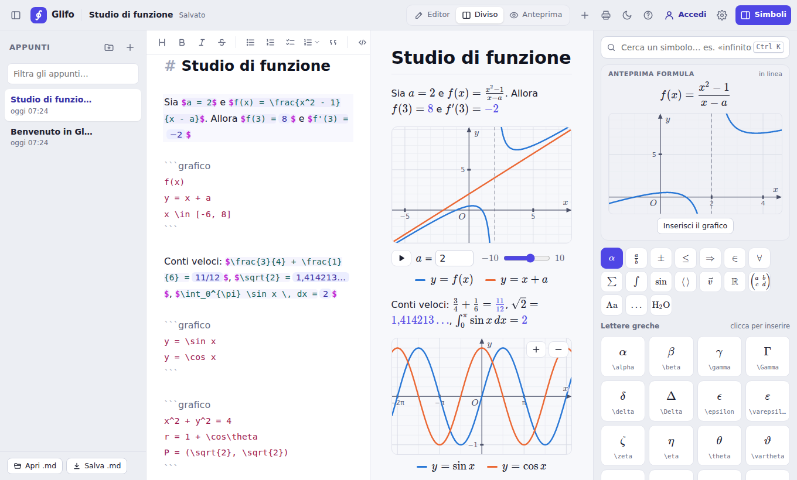

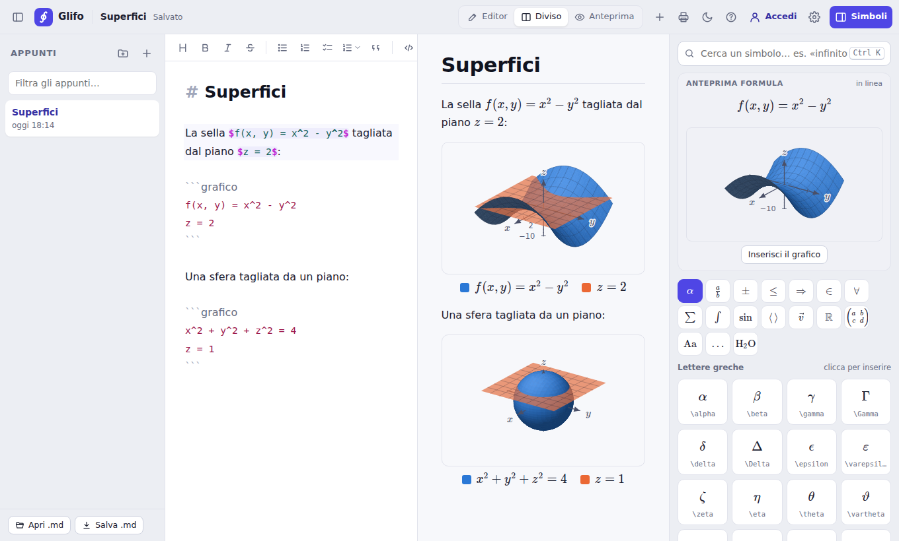

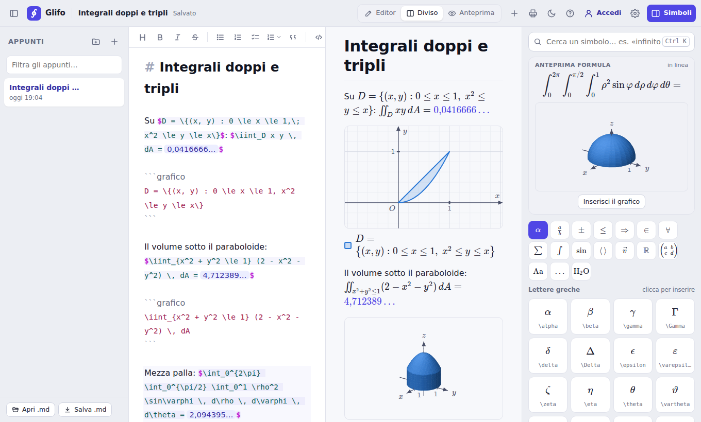

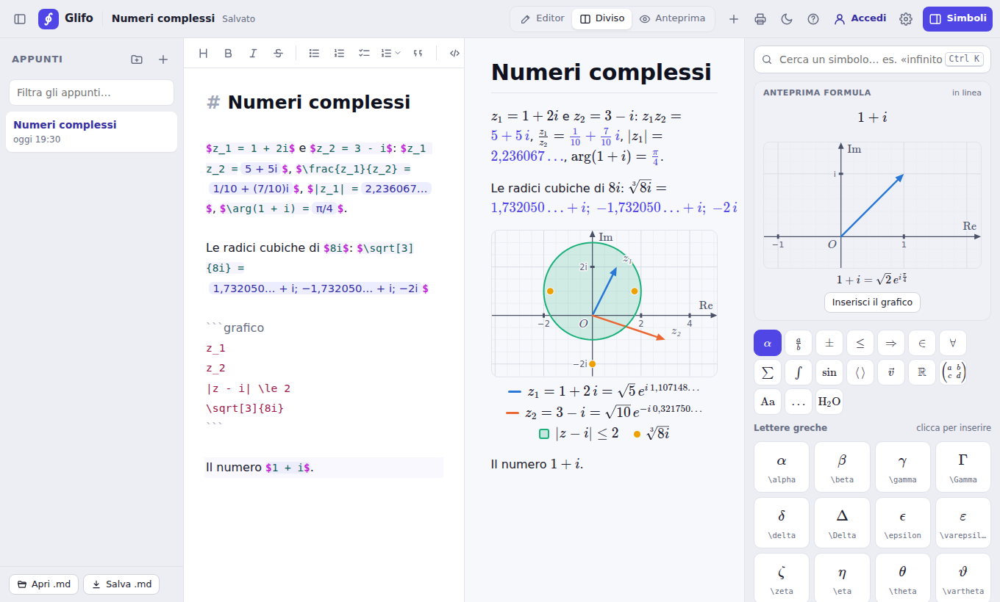

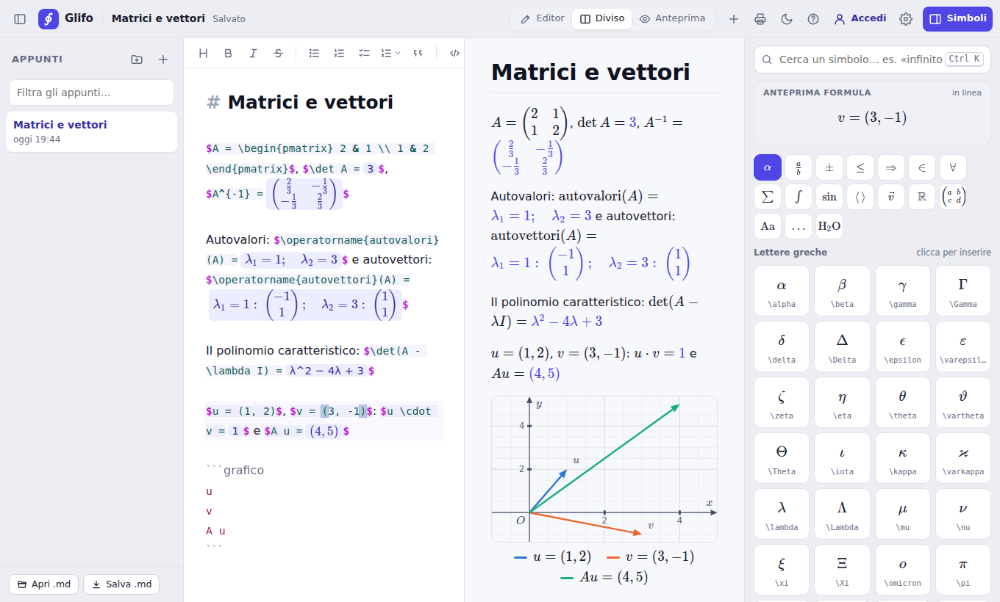

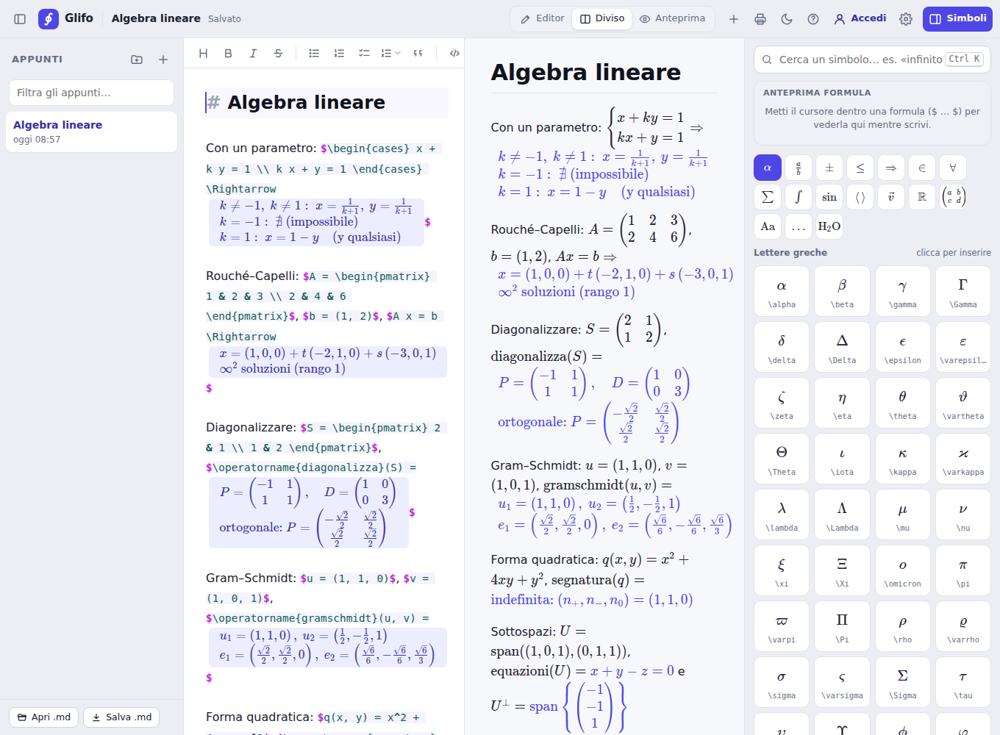

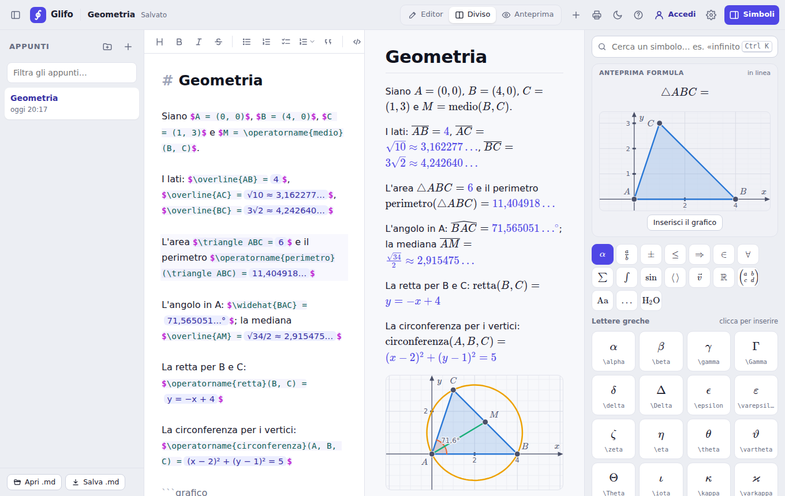

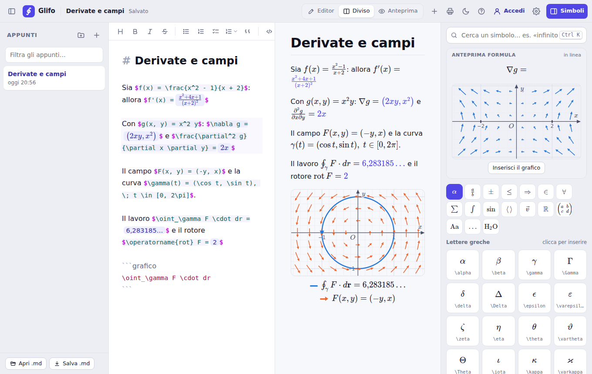

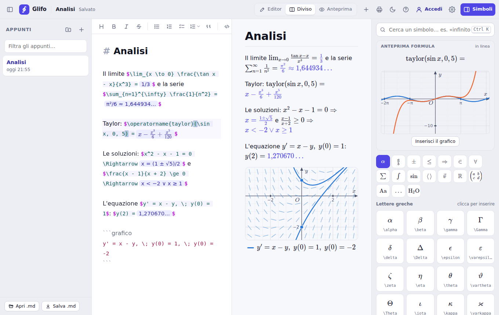

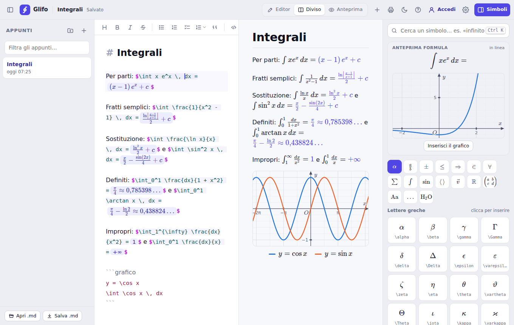

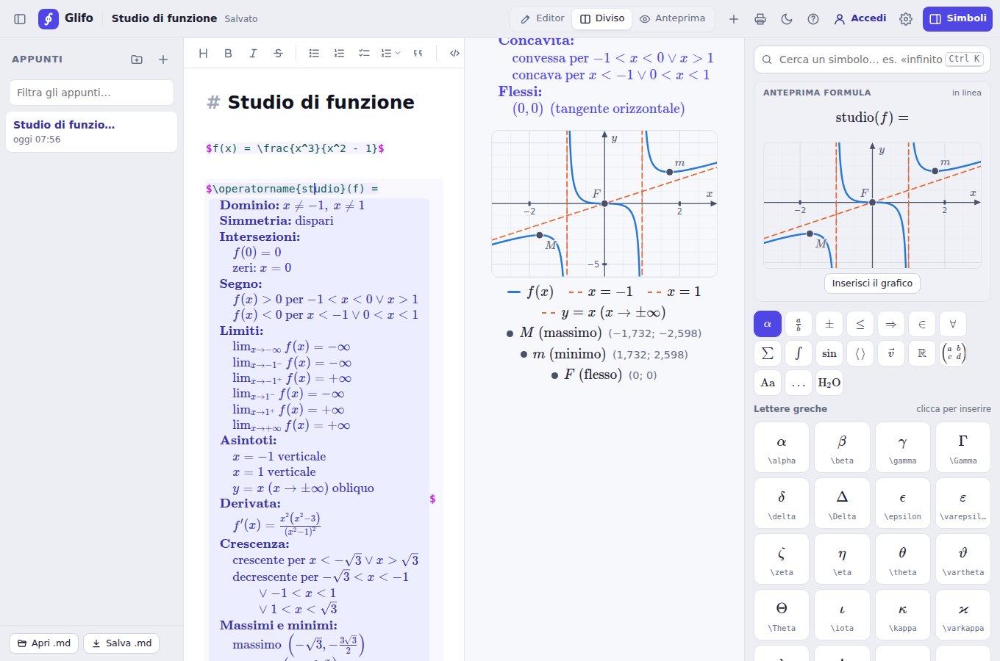

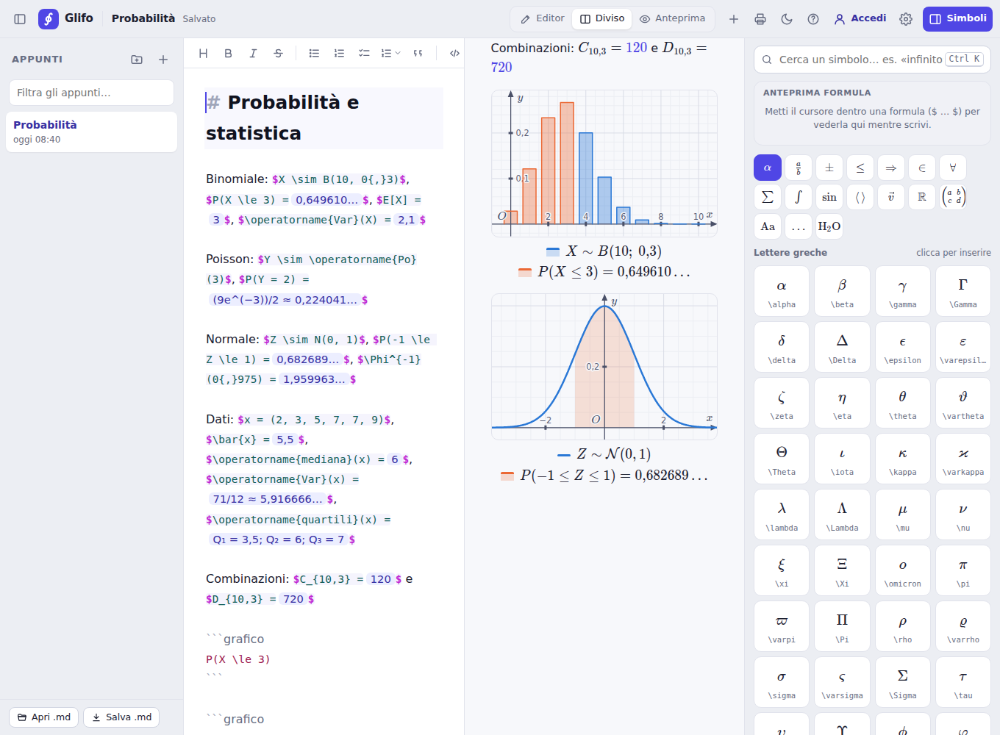


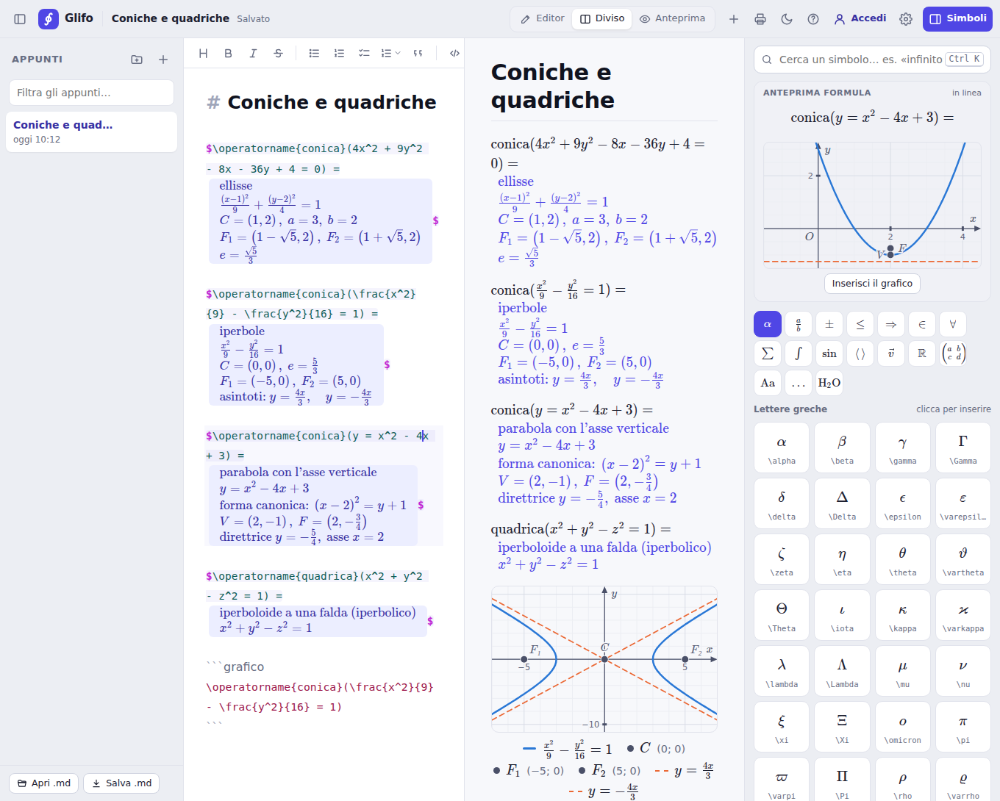


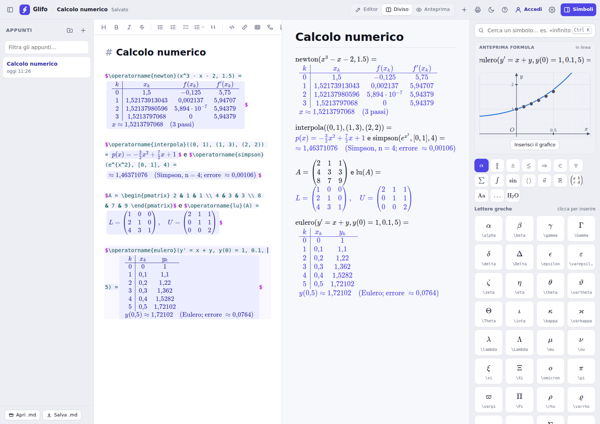


**Schemi stile draw.io**
- Il pulsante con i due riquadri nella barra apre un editor a tutto schermo: forme a sinistra
  (rettangolo, arrotondato, ellisse, rombo, parallelogramma, esagono, triangolo, nuvola,
  documento, cilindro, nota, freccia grande e doppia, testo, corsie), da trascinare sul foglio o da
  cliccare; passando sopra una forma compaiono le **frecce blu**: trascinandone una la colleghi
  a un'altra forma (o, nel vuoto, ne nasce una nuova), cliccandola aggiungi una forma collegata.
- **Basi di dati** (gruppo da aprire nel pannello): entità ed entità debole, relazione e relazione
  identificante, attributi (chiave sottolineata, multivalore, derivato, e a pallino come nei libri
  italiani, pieno per l'identificatore), tabella con un campo per riga (`PK` sottolinea la chiave
  primaria, `FK` segna quella esterna, anche insieme; il tipo dopo i due punti, `Matricola:
  CHAR(6)`) e database. La tabella si scrive com'è disegnata: il nome nella fascia in alto e i
  campi sotto, con un doppio clic sul nome o sul campo da cambiare. Selezionandola, nel pannello a
  destra la si cambia **campo per campo**: PK ed FK da premere, il nome, il tipo, la × per
  toglierlo e «Aggiungi campo».
- **Codice SQL** delle tabelle, da «Scarica»: `CREATE TABLE` con chiavi primarie ed esterne, per
  SQL standard, PostgreSQL, MySQL/MariaDB, SQLite, Oracle o SQL Server, da scaricare come file
  `.sql` o copiare. Le chiavi esterne trovano la loro tabella con le frecce tra le tabelle o con i
  nomi; quello che non si capisce resta in una nota nel codice.
- **Processi con le corsie** (chi fa cosa, come nei diagrammi dei processi aziendali e dei
  gestionali ERP): la forma **Corsie** è un riquadro diviso in corsie, una per chi lavora (cliente,
  vendite, magazzino…), con i nomi nella fascia in alto, o a sinistra se le corsie sono in righe. Le
  forme del processo si mettono sopra, nella corsia di chi fa quel passo. Le corsie si prendono dalla
  fascia dei nomi e, spostandole, le forme che ci sono sopra vengono con loro; dentro una corsia il
  clic, il riquadro per scegliere più forme e il doppio clic sono come sul foglio vuoto. Il nome di
  una corsia si cambia con un doppio clic sul nome; nel pannello a destra si aggiungono e si tolgono
  corsie (le altre restano grandi com'erano) e si sceglie se sono in colonne o in righe.
- **Modelli pronti** da cui partire, sul foglio vuoto o dal menu «Modelli»: diagramma di flusso,
  mappa concettuale, albero, ciclo, linea del tempo, processo con le corsie (l'ordine di un cliente,
  dalle vendite al magazzino all'amministrazione), schema E-R e tabelle.
- Con più forme selezionate (trascinando un riquadro sul foglio vuoto, o con Maiusc + clic):
  **allinea** (a sinistra, al centro, in alto…) e **distribuisci** con lo stesso spazio;
  triangolo e frecce grandi si **girano** di un quarto alla volta.
- **Scarica** lo schema come immagine PNG (nitida, alla misura giusta anche in Word) o SVG,
  oppure **copialo come immagine** e incollalo in Word, Google Docs o nelle slide.
- Doppio clic (o scrivere con una forma selezionata) per il testo, anche con **formule**
  `$ … $` (si finisce con Esc o con un clic sul foglio; Ctrl+S salva anche mentre si scrive); colori, forma, dimensione del testo, frecce dritte, ad angolo o **curve**, con o senza
  punte, tratteggiate, con il testo all'inizio, a metà o alla fine (per le cardinalità). Annulla/Ripeti, copia e incolla, zoom, griglia, selezione a rettangolo.
- Lo schema va nella nota come blocco ` ```schema ` (un JSON corto, una forma per riga):
  nell'anteprima si vede il disegno, nel testo una riga con «Modifica». Nell'anteprima, accanto a
  «Modifica», le frecce ↑ ↓ lo spostano nella nota, come i grafici. I colori seguono il
  tema chiaro o scuro. Funziona anche offline: è fatto con [maxGraph](https://github.com/maxGraph/maxGraph),
  il motore di draw.io, che si carica solo quando serve.
- Con **Salva .md** ogni schema finisce nel file come **immagine** (SVG, chiara su bianco), così
  si vede anche nell'anteprima di VS Code o in Obsidian; il suo JSON resta nel file, in un
  commento che non si vede, e riaprendo il file con **Apri .md** lo schema torna da modificare.

**Tabelle con le formule, come Excel**
- Il pulsante della tabella nella barra apre un menu: **Tabella con le formule** apre un editor a
  tutto schermo fatto come Excel (le colonne A, B, C…, le righe 1, 2, 3…, la casella con il nome
  della cella e la barra della formula `fx`); **Tabella di testo** mette la solita tabella di
  Markdown. Per gli esercizi di economia aziendale (costi, ricavi, punto di pareggio, IVA,
  ammortamenti), e per ogni tabella con dei conti.
- Si scrive come in Excel: un numero (`1,5`, `1.200`, anche in euro `1,50 €` o in percentuale
  `22%`), un testo, o una **formula** che comincia con `=`: `=B2*C2`, `=SOMMA(D2:D5)`,
  `=SE(B2>=6; "promosso"; "bocciato")`. I nomi delle funzioni sono quelli dell'**Excel italiano**,
  con il punto e virgola tra gli argomenti (vanno bene anche quelli inglesi, SUM, IF…, che diventano
  italiani). Mentre scrivi `=so` compaiono le funzioni che cominciano così, con due righe di aiuto;
  dentro le parentesi, sotto la barra, c'è come si scrive (`SOMMA(numero1; [numero2]; …)`).
- **Le funzioni**: SOMMA, MEDIA, MIN, MAX, PRODOTTO, ARROTONDA (anche PER.ECC e PER.DIF), TRONCA,
  INT, ASS, RADQ, POTENZA, RESTO, PI.GRECO, EXP, LN, LOG; MEDIANA, MODA, GRANDE, PICCOLO, DEV.ST,
  VAR; CONTA.NUMERI, CONTA.VALORI, CONTA.VUOTE, **CONTA.SE**, **SOMMA.SE**, MEDIA.SE (criteri come
  `">=6"`, `"<>0"`, `"A*"`), SOMMA.PRODOTTO; **SE**, E, O, NON, SE.ERRORE, VAL.ERRORE, VAL.NUMERO,
  VAL.TESTO, VAL.VUOTO; **CERCA.VERT** e CERCA.ORIZZ (esatto con FALSO, o la fascia più vicina, per
  gli sconti), CONFRONTA, INDICE; CONCATENA (e `&`), LUNGHEZZA, MAIUSC, MINUSC, SINISTRA, DESTRA,
  STRINGA.ESTRAI, ANNULLA.SPAZI, TESTO, VALORE; e la **matematica finanziaria**: RATA, VA, VAL.FUT,
  INTERESSI, P.RATA, VAN, TIR.COST, AMMORT.COST (con i segni di Excel: i soldi che escono sono
  negativi). Gli operatori `+ - * / ^ %`, `&` e i confronti `= <> < > <= >=`; `$B$2` resta fisso
  quando si copia la formula.
- **I formati**: il risultato prende il formato da quello che la formula usa, come le unità di
  misura: quantità per prezzo in euro fa euro (con i centesimi), euro diviso euro è un numero. Con
  i pulsanti **€**, **%**, **000** (punti delle migliaia) e i decimali (**←,0** e **,00→**) lo
  scegli tu, come per la percentuale sui ricavi.
- Gli **errori** sono quelli di Excel (#DIV/0!, #VALORE!, #RIF!, #NOME?, #N/D, #NUM!) e, scelta la
  cella, sotto la barra c'è cosa è successo; una formula che usa il proprio risultato (anche
  passando da altre celle) è #RIF!, una che non si legge è #ERRORE! con il motivo (per esempio
  «Manca una parentesi chiusa»).
- **I tasti di Excel**: Tab va a destra e Invio torna sotto la prima cella da cui sei partito con
  Tab; le frecce (con Ctrl fino in fondo ai dati, con Maiusc per scegliere più celle), F2 per
  cambiare la cella, Canc per svuotarla, Ctrl+Z e Ctrl+Y, Ctrl+B grassetto, Ctrl+D e Ctrl+R
  riempiono in basso e a destra, Ctrl+A sceglie tutto, Ctrl+S salva nella nota. Mentre scrivi
  una formula, un **clic su una cella** (o trascinando, per un intervallo) ne scrive il nome, e
  così le frecce subito dopo un operatore; **F4** mette il `$`. Le celle usate dalla formula si
  colorano, ognuna del suo colore.
- **Copia e incolla** anche con Excel e Fogli Google (e le tabelle di Markdown); le formule
  copiate si spostano con la cella. La **maniglia** nell'angolo della selezione riempie le celle
  vicine trascinandola, e due numeri in fila continuano la serie (1, 2 → 3, 4, 5). **Σ** fa la
  somma dei numeri sopra (o a sinistra). Con il tasto destro (o i menu «Righe» e «Colonne») si
  aggiungono e tolgono righe e colonne, e le formule si aggiustano come in Excel.
- **Modelli pronti** dal menu «Modelli»: fattura con l'IVA, punto di pareggio (con la tabella
  dei costi fissi, dei costi totali e dei ricavi, da cui «Grafico» fa il diagramma), conto economico
  con la percentuale sui ricavi, piano di ammortamento con la rata costante, **prezzo di vendita**
  dai costi (costo primo, industriale e complessivo, il ricarico e l'IVA), **preventivo di un
  progetto** (le ore di ogni risorsa per il costo orario, i costi generali, il ricarico) e le attività
  per il **diagramma di Gantt** (lo sviluppo di un sito: durate, precedenti, chi le fa). Si cambiano i
  numeri e i conti si rifanno.
- **File di Excel e .csv** (menu «File» dell'editor): **Scarica come Excel (.xlsx)** dà la tabella
  con le formule (nel file in inglese, come le vuole Excel: SOMMA diventa SUM), i risultati, i
  formati in euro e in percentuale, il grassetto e l'intestazione bloccata; si apre in Excel, in
  LibreOffice e in Fogli Google. **Scarica come .csv** dà i valori come si vedono, con il punto e
  virgola dell'Excel italiano. **Apri un file Excel o .csv…** mette al posto della tabella un foglio
  di un file .xlsx (con più fogli si sceglie quale) o un .csv (con il punto e virgola, la virgola o il
  tabulatore, i numeri all'italiana o all'inglese): le formule tornano in italiano; quelle con
  funzioni che Glifo non ha, o con altri fogli, restano con il loro valore (lo dice), le date
  diventano testo. Prima si chiede, e Annulla riporta la tabella com'era. Anche **Apri .md**, nella
  barra laterale, apre un file .xlsx o .csv: diventa una nota con una tabella per foglio.
- Nella nota la tabella è un blocco ` ```tabella `, una riga di testo per ogni riga della tabella
  (`| Penne | 10 | 1,50 € | =B2*C2 |`): nell'**anteprima** si vede con i risultati, i numeri
  allineati a destra, l'intestazione e il grassetto; passando sopra una cella si legge la formula.
  Nel testo è una riga «Tabella · 4 righe, 4 colonne · …» con «Modifica» (anche il doppio clic
  sulla tabella nell'anteprima la riapre). Le frecce ↑ ↓ la spostano nella nota, come i grafici.
  Le celle di testo hanno il loro Markdown, anche le formule `$…$`.
- Con **Salva .md** la tabella finisce nel file come **tabella di Markdown con i risultati**, che
  si legge anche in VS Code, su GitHub o in Obsidian; le formule restano nel file, in un commento
  che non si vede, e riaprendolo con **Apri .md** la tabella torna da modificare.
- Sul telefono un tocco sceglie la cella e un altro tocco ci scrive; Invio conferma e sceglie la
  cella sotto, dove basta un tocco per scrivere.
- **Grafico** (nella barra dell'editor) fa il grafico delle celle scelte, sotto la tabella nella nota:
  la prima colonna sull'asse x, le altre come linee. Con una cella sola prende il blocco di dati
  attorno a lei (o il primo della tabella, se lì non ci sono numeri da disegnare). Se tra le colonne
  ci sono i **ricavi** e i **costi totali** è il **grafico del punto di pareggio**, con l'utile e la
  perdita colorati (la colonna dell'utile in fondo resta fuori: lo mostrano le aree). Sulle
  **attività di un progetto** (con la durata e le precedenti) un menu chiede se fare il **diagramma
  di Gantt** o il **reticolo**. Premuto di nuovo, rifà il grafico dello stesso tipo che c'è già sotto
  la tabella (gli altri restano: il Gantt e il reticolo stanno uno dopo l'altro). Nella nota è un
  blocco ` ```grafico ` con la riga `dati: A8:D13` (o `gantt:`, `reticolo:`; vedi i grafici): si può
  anche scrivere a mano.

**Lavagna**
- La vista **Lavagna** (in alto, accanto a Editor, Diviso e Anteprima) apre accanto al testo,
  al posto dell'anteprima, un foglio a quadretti dove **scrivere a mano**: con la penna (Apple
  Pencil, S Pen, una tavoletta grafica anche senza schermo), con il dito o con il mouse. Non
  entra nella nota: è il foglio accanto alla calcolatrice, per i conti e le prove.
- **Penna con la pressione** (piano scrive sottile, forte spesso) in quattro colori (il primo è
  nero nel tema chiaro e bianco in quello scuro, dove la lavagna è scura), **evidenziatore** in
  quattro colori, trasparente e sempre sotto la scrittura (anche passato dopo), e **gomma** con due
  modi, come in Microsoft Whiteboard: **Dove passa** cancella solo dove passa e, mossa veloce, si
  allarga; **Linea intera** toglie tutta la linea che tocca, anche in un punto solo. Cancellano
  anche la gomma in fondo alla penna e la penna con il tasto laterale.
- **Spessori**: premendo di nuovo lo strumento scelto, o il pulsante con il pallino accanto ai
  colori, si sceglie lo spessore della penna e dell'evidenziatore e quanto è grande la gomma (tre
  misure); quello della gomma apre anche i suoi due modi. Le scelte restano su quel dispositivo, e
  cambiando strumento la barra non si sposta (sulla lavagna stretta si stringe).
- **Linee e figure precise**, come in Microsoft Whiteboard e nelle Note dell'iPad: alla fine del
  tratto si tiene ferma la penna (o il dito, o il mouse) per mezzo secondo e il tratto diventa la
  figura precisa più vicina: linea, freccia, spezzata, triangolo, rettangolo o quadrato, rombo,
  pentagono, esagono, ellisse o cerchio. Quelle quasi dritte diventano dritte, gli angoli quasi
  retti retti. Finché la penna è giù la si regola: la linea si allunga o gira, le figure si
  ingrandiscono. Con l'evidenziatore la linea diventa dritta. Nel menu della penna (premuta di
  nuovo) c'è l'interruttore **Forme automatiche**: acceso, le figure diventano precise da sole,
  senza fermarsi; la scrittura e le figure piccole restano come sono. Annulla riporta il tratto
  fatto a mano.
- **Selezione**, come in Note di Apple: con il lazo (l'ultimo strumento) si disegna intorno a
  quello che si vuole prendere, o si tocca una linea; i tratti presi hanno intorno un alone. Si
  trascinano per spostarli e si ingrandiscono tirando il pallino nell'angolo (anche lo spessore);
  toccandoli si apre il menu con **Taglia**, **Copia**, **Duplica**, **Elimina** e i colori.
  Toccando un punto vuoto c'è **Incolla**, e nella barra **Tutto** e **Incolla**. Dalla tastiera
  Ctrl+A, Ctrl+C, Ctrl+X, Ctrl+V, Ctrl+D, Canc, le frecce ed Esc. Ogni cosa si annulla con
  Annulla, e quello che si incolla va anche nella lavagna di un'altra nota.
- **Annulla** e **Ripeti** (anche Ctrl+Z e Ctrl+Y) e **Pulisci**, con la conferma.
- **Spostarsi e ingrandire**: due dita, oppure la rotellina (con Ctrl ingrandisce), il tasto
  centrale o lo spazio tenuto premuto; il numero in basso a destra riporta alla vista di
  partenza. Quando Glifo vede una penna se lo ricorda: da lì un dito solo non fa niente, così
  **la mano appoggiata** non scrive, non sposta la lavagna e non preme i pulsanti (nemmeno se
  tocca un attimo dopo che la penna si è alzata).
- **A tutto schermo** con il pulsante con i quattro angoli (Esc torna indietro): con una tavoletta
  senza schermo si scrive guardando lo schermo, e più la lavagna è grande meglio è. Sul telefono
  la vista Lavagna prende già tutto il posto del testo. Su iPad e iPhone la lavagna copre la
  finestra senza lo schermo intero del browser: lì Safari ne usciva mentre si scriveva, perché
  prendeva i tocchi della penna per una tastiera.
- **Registro dei tocchi** (nelle impostazioni): serve a capire un problema su un dispositivo che
  non si ha sotto mano, come l'iPad con la penna. Acceso, annota quello che fanno penna e dita
  sulla lavagna, che cosa ne decide Glifo (per esempio «è la mano») e quello che fa il browser
  (selezione, fuoco, tastiera, schermo intero, pagina nascosta, errori), senza il testo delle note.
  Un pallino rosso sulla lavagna lo apre: si scrive cosa è successo e lo si copia, scarica o
  condivide per mandarlo. Resta nel browser finché non lo si manda.
- **Una lavagna per ogni nota**, salvata su quel dispositivo (nel browser, in IndexedDB), non
  nella nota né nell'account: niente esce dal dispositivo. Eliminando la nota si elimina anche
  la sua lavagna; il backup la porta con sé. Con Glifo aperto in due schede, quello che si
  scrive in una compare nell'altra.

**Appunti**
- Salvati automaticamente nel browser, con elenco, filtro e più note; con l'account, anche su
  tutti i tuoi dispositivi.
- **Cartelle** per organizzarli, per esempio una per corso: le note nuove finiscono nella
  cartella della nota aperta, e il pulsante accanto a ogni nota la sposta.
- Apri e salva file `.md` dal computer (su Chrome/Edge si risalva sullo stesso file); nel
  file gli schemi sono immagini.
- Anteprima affiancata con scorrimento sincronizzato; doppio clic sull'anteprima porta alla riga.
- Stampa / PDF dell'anteprima (da «Condividi»), backup di tutti gli appunti (con le lavagne).
- Niente barra in alto, come nell'app di Claude: a sinistra la **barra laterale**, che si apre e
  si chiude con il logo in alto a sinistra (come in Gemini); sotto il logo subito gli appunti, in
  fondo una riga con «Apri .md», «Salva .md» e l'icona di «Condividi», poi l'account, «Come si usa» e le
  impostazioni (lì c'è anche il tema). Sopra il testo una riga sola: a sinistra i pulsanti per
  formattare, al centro le viste (Editor, Diviso, Anteprima, Lavagna), a destra quelli per inserire e i
  **Simboli**, vicino al loro pannello.
- **Tutorial** la prima volta che si entra: poche pagine, ognuna con un video e due righe, da
  sfogliare con Indietro e Avanti; l'ultima ha «Inizia». Si riapre da «Come si usa» (il «?» in
  fondo alla barra laterale: quando si chiude il tutorial, un fumetto lo indica per qualche
  secondo), e da lì si arriva a tutte le scorciatoie.
- Sezioni in tonalità diverse (la cornice è più scura del foglio su cui si scrive) e **da
  allargare o stringere**: trascina il bordo dell'elenco degli appunti, del pannello dei
  simboli o quello tra testo e anteprima (o usa le frecce, quando il bordo ha il fuoco); con un
  doppio clic tornano alla misura di partenza. Le misure restano su quel dispositivo.
- Tema chiaro e scuro (nelle impostazioni), funziona su telefono e tablet, **installabile come
  app** e usabile offline.

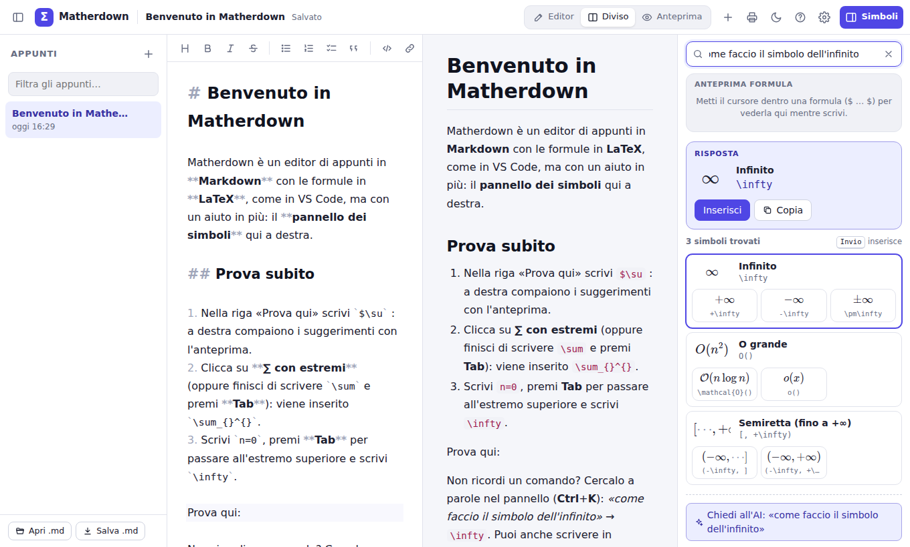

## Provarlo sul tuo computer

Serve [Node.js](https://nodejs.org) 24 o successivo (il 22 funziona, ma `npm install` avvisa che il correttore
ortografico chiede il 24).

```bash
npm install
npm run dev
```

Poi apri l'indirizzo che compare nel terminale (di solito <http://localhost:5173>).

| Comando | Cosa fa |
| --- | --- |
| `npm run dev` | avvia l'app in sviluppo (si aggiorna da sola quando modifichi il codice) |
| `npm run build` | controlla i tipi e crea la versione da pubblicare in `dist/` |
| `npm run preview` | prova in locale la versione di `dist/` |
| `npm test` | esegue i test automatici |
| `npm run test:e2e` | prova il flusso principale in un browser vero (dopo `npm run build`) |

Per `npm run test:e2e` serve Chromium: `npx playwright-core install chromium`
(oppure indica un Chromium già installato con la variabile `CHROMIUM_PATH`).

## Come viene pubblicata

Il sito online è su **GitHub Pages** e si aggiorna da solo: ogni volta che cambia il branch
principale del repository, l'automazione `.github/workflows/deploy.yml` esegue i test,
compila l'app (`npm run build`) e copia la cartella `dist/` nel branch `gh-pages`, che è
quello pubblicato da GitHub Pages. Si può anche rilanciare a mano dalla scheda *Actions*.

`dist/` è un normale sito statico, quindi funziona anche su altri hosting gratuiti come
**Cloudflare Pages** o **Netlify** (comando di build `npm run build`, cartella `dist`).

## Assistente AI

La ricerca dei simboli è locale: funziona sempre, anche senza internet, ed è gratuita.
L'assistente AI serve solo per le domande che la ricerca non capisce e usa una **tua chiave**,
del servizio che scegli in **Impostazioni → Assistente AI**:

- **Anthropic (Claude)**: crea una chiave su <https://console.anthropic.com/settings/keys>. Il
  modello predefinito è Claude Opus 5.5 (con ragionamento ridotto, per rispondere in fretta);
  nelle impostazioni puoi scegliere Sonnet 5.5 o Haiku 4.5, più economici. Se la richiesta viene
  rifiutata dai filtri di sicurezza, l'app chiede all'API di riprovare in automatico con un altro
  modello (`fallbacks: "default"`).
- **Google Gemini**, **gratis** e senza carta di credito: crea la chiave in Google AI Studio
  (<https://aistudio.google.com/apikey>). Il modello di partenza è `gemini-flash-lite-latest`; il
  piano gratuito ha un limite di domande al giorno e Google può usare quelle domande per
  migliorare i suoi modelli.
- **OpenRouter**: con una chiave sola (<https://openrouter.ai/keys>) tanti modelli, anche aperti
  come Qwen e Gemma; `openrouter/free` sceglie ogni volta un modello gratuito.
- **Ollama**, i modelli aperti **sul tuo computer**, gratis e senza internet: installa
  <https://ollama.com>, scarica un modello (`ollama pull qwen3`) e avvialo permettendo le
  richieste da Glifo: `OLLAMA_ORIGINS=https://diodialtro.github.io ollama serve`.
- **Un altro servizio compatibile con OpenAI** (OpenAI, Mistral, Groq, DeepSeek, LM Studio…):
  l'indirizzo della sua API, il modello e, se serve, la chiave.

Poi nel pannello dei simboli scrivi la domanda e premi **Chiedi all'AI** (o Ctrl+Invio): sopra
la risposta si vede quale modello ha risposto. Le chiavi restano salvate **solo nel tuo browser**
e la domanda va direttamente al servizio scelto, senza passare da Glifo. I modelli che non sanno
rispondere con lo schema chiesto ricevono la forma della risposta nelle istruzioni.

Se pubblichi Glifo per altri studenti e non vuoi che ognuno usi la propria chiave, puoi
mettere la chiave di Anthropic in un piccolo server "proxy" (per esempio un Cloudflare Worker)
e indicarne l'indirizzo in **Impostazioni → Assistente AI → Avanzate**.

## Spiegami (in prova)

Con il cursore su un conto che Glifo sa fare (una formula che finisce con `=`, un risultato scritto
come `\int_0^1 x^2 \, dx = \frac{1}{2}`, un'equazione con `\Rightarrow`), sotto l'anteprima della
formula compare **Spiegami**. Premendolo, i passaggi li scrive **Qwen3**, un modello AI aperto che
gira **nel browser** con [WebLLM](https://github.com/mlc-ai/web-llm), sulla scheda grafica (WebGPU):
niente chiave, niente costi, e la nota non esce dal dispositivo. Serve un browser con WebGPU (Chrome
o Edge aggiornati, su un computer).

I conti li fa il **motore di Glifo**: il modello glieli chiede (calcolare, controllare
un'uguaglianza, derivare, trovare una primitiva, risolvere), e alla fine Glifo controlla ogni
passaggio. Accanto a ogni passaggio c'è il segno: ✓ giusto, ✗ sbagliato (con il valore giusto) o
«non controllato» quando non si sa controllare (una sostituzione come $u = x^2$). Se qualcosa non
torna, Glifo lo fa correggere al modello prima di mostrare la spiegazione; sotto si vede se l'ultimo
passaggio arriva al risultato di Glifo. **Inserisci nella nota** mette i passaggi dopo la formula,
come elenco numerato (e lì Glifo li controlla come le altre formule); **Rifai** ne chiede un'altra.

In **Impostazioni → Spiegazioni** si sceglie il modello (Qwen3 0.6B, il più leggero, circa 0,4 GB;
1.7B, consigliato, circa 1 GB; 4B, il più bravo, circa 2,3 GB) e il tono (come il professore o più
semplice). Il modello si scarica da Hugging Face la prima volta che premi Spiegami e poi resta nel
browser: le spiegazioni funzionano anche offline; dalle impostazioni lo puoi togliere. Dentro
claude.ai il modello non si può scaricare: lì Spiegami lo dice.

## Compatibilità con VS Code

Gli appunti sono normali file `.md`: puoi aprirli in VS Code, Obsidian o su GitHub.
Il riconoscimento di `$ … $` e `$$ … $$` ricalca quello dell'anteprima Markdown di VS Code
(stesso motore, KaTeX). Le differenze:

- la chimica con `\ce{…}` (estensione mhchem) funziona in Glifo ma non nell'anteprima standard
  di VS Code;
- gli elenchi con lettere, numeri romani ed etichette (`a)`, `ii)`, `es)`) e il pallino `•` sono
  di Glifo: altrove si vedono come testo normale (`-`, `*`, `1.` e `1)` vanno bene ovunque);
- in Glifo il rientro serve agli elenchi: il codice si scrive tra ` ``` ` (i blocchi di codice
  fatti solo con quattro spazi di rientro non ci sono);
- gli schemi, salvati con **Salva .md**, nel file sono immagini scritte dentro il file stesso
  (`data:image/svg+xml`): VS Code le mostra, GitHub no. Il JSON dello schema è subito sotto, in
  un commento `<!-- glifo-schema … -->`: si può leggere, e Glifo lo usa quando riapre il file.
  Lo stesso per i grafici, con il testo del blocco in `<!-- glifo-grafico … -->`;
- i risultati dopo `=` sono di Glifo: nel file ci sono solo quelli scritti nella formula con Tab.

## Com'è fatto

Web app in **TypeScript** con [Vite](https://vite.dev), senza framework e senza server.

| Parte | Libreria |
| --- | --- |
| Editor | [CodeMirror 6](https://codemirror.net) con un'estensione per le formule |
| Formule | [KaTeX](https://katex.org) (+ mhchem per la chimica) |
| Anteprima Markdown | [markdown-it](https://github.com/markdown-it/markdown-it), highlight.js, DOMPurify |
| Controllo ortografico | [Hunspell](https://hunspell.github.io) in WebAssembly ([@farscrl/hunspell-wasm](https://github.com/farscrl/hunspell-wasm)) in un worker, dizionari [dictionary-it e dictionary-en](https://github.com/wooorm/dictionaries) |
| Assistente AI | SDK ufficiale di Anthropic (caricato solo quando serve) |
| Spiegami (in prova) | [WebLLM](https://github.com/mlc-ai/web-llm) con i modelli Qwen3, sulla scheda grafica con WebGPU (in un worker, caricato solo quando serve) |
| Account e sincronizzazione | [Supabase](https://supabase.com): database Postgres e accesso via email, senza password (il client si carica solo se si accede) |
| Schemi | [maxGraph](https://github.com/maxGraph/maxGraph), il motore di draw.io (caricato solo quando serve) |
| Lavagna | [perfect-freehand](https://github.com/steveruizok/perfect-freehand) per il contorno dei tratti con la pressione; disegno su canvas, salvataggio in IndexedDB |
| File di Excel | [fflate](https://github.com/101arrowz/fflate) per lo zip (un .xlsx è uno zip di file XML, scritti e letti da Glifo) |
| Calcoli e grafici | scritti per Glifo: lettura delle formule LaTeX, conti (anche esatti, con le frazioni), disegno in SVG |
| App installabile | vite-plugin-pwa |

```
src/
  main.ts                 avvio dell'app e collegamento dei pezzi
  welcome.md              la nota di benvenuto
  symbols/                il "dizionario" dei simboli
    data/*.ts             i simboli, divisi per categoria
    template.ts           segnaposto (#) e anteprime (⋯)
  search/
    suggest.ts            suggerimenti mentre si scrive \…
    search.ts             ricerca a parole (italiano/inglese, sinonimi, errori di battitura)
  lists/markers.ts        i marcatori degli elenchi (1), a), ii), es), •…), per editor e anteprima
  editor/
    lists.ts              Invio, Tab, Maiusc+Tab e Backspace negli elenchi, menu dei tipi
    mathSyntax.ts         riconosce $…$ e $$…$$ nell'editor
    mathContext.ts        "il cursore è in una formula? che comando sto scrivendo?"
    placeholders.ts       i segnaposto raggiungibili con Tab
    insert.ts             inserimento dei simboli (aggiunge i $, usa la selezione…)
    suggestions.ts        stato dei suggerimenti (↑ ↓ Tab Esc)
    spellcheck.ts         sottolineatura delle parole sbagliate e correzioni
    calcResults.ts        i risultati dopo «=» nell'editor (Tab li scrive)
    graphInsert.ts        il pulsante «Grafico»: la funzione sotto il cursore in un blocco ```grafico
    moveBlock.ts          lo spostamento di uno schema o di un grafico come una modifica (un passo di Annulla)
    editor.ts             configurazione di CodeMirror
  spell/
    words.ts              divide il testo in parole (salta indirizzi, codice, sigle…)
    engine.ts             Hunspell con i dizionari, glossario e dizionario personale
    glossary.ts           termini tecnici e cognomi che i dizionari non conoscono
    worker.ts, client.ts  il correttore gira in un worker, fuori dalla pagina
  render/
    mathDelims.ts         regole dei delimitatori (condivise da editor e anteprima)
    markdown.ts           Markdown → HTML sicuro (niente script, moduli, pulsanti o stili)
    blockMove.ts          spostare schemi e grafici oltre il blocco vicino (le frecce ↑ ↓, come in Colab)
    lists.ts              elenchi con tutti i marcatori e rientri comodi nell'anteprima
    katex.ts              disegno delle formule, messaggi di errore in italiano
  ui/                     pannello dei simboli, anteprima, elenco appunti, finestre,
                          bordi da trascinare tra le sezioni (resize.ts), il simbolo ∮ (logo.ts),
                          il registro dei tocchi nelle impostazioni (touchLogPanel.ts), le frecce
                          ↑ ↓ di schemi e grafici (moveButtons.ts)
  store/                  salvataggio nel browser, file .md, impostazioni, misure delle sezioni (layout.ts)
  ai/assistant.ts         assistente AI: Anthropic con l'SDK, gli altri servizi nella «lingua» di OpenAI
  ai/services.ts          i servizi per la propria chiave: Anthropic, Gemini, OpenRouter, Ollama, altri
  account/
    sync.ts               sincronizzazione: manda e scarica le modifiche, nei conflitti tiene tutte e due le versioni
    controller.ts         quando sincronizzare (avvio, ritorno su Glifo, rete, dopo le modifiche)
    space.ts              le note di ogni account in uno spazio a parte del browser
    supabase.ts           accesso con Google o via email (link o codice), eliminazione dell'account,
                          le chiamate per condividere una nota con un link
    export.ts             il file di «Scarica i miei dati»
  board/                  la lavagna, per scrivere a mano accanto al testo (una per nota)
    strokes.ts            i tratti come vettori (punti con la pressione) e la gomma che li taglia
    shapes.ts             le figure precise: linee, frecce, poligoni ed ellissi riconosciuti nel tratto
    selection.ts          la selezione: il lazo, i tratti presi, spostare, ingrandire, copiare, colori
    ink.ts                il contorno dei tratti (perfect-freehand) e i colori dei due temi
    store.ts              le lavagne in IndexedDB, un tratto per record, e le altre schede avvisate
    board.ts              penna, dita, mouse e palmo; strumenti, lazo, menu, annulla, spostare e ingrandire
    device.ts             iPad e iPhone, dove lo schermo intero del browser non va bene per scrivere
    touchlog.ts           il registro dei tocchi: penna, dita, decisioni della lavagna e browser
  share/                  le note condivise con un link (una fotografia della nota)
    link.ts               il link (nota.html#codice) e la lettura della nota, anche senza account
    dialog.ts             la finestra «Condividi»
    page.ts               la pagina nota.html: la nota in sola lettura e «Salva una copia»
  spreadsheet/            le tabelle con le formule, come Excel (blocchi ```tabella)
    model.ts              il formato del blocco: le righe con |, l'intestazione, il grassetto, i formati tra graffe
    formula.ts            le formule all'italiana: lettura, riferimenti che si spostano copiando, righe aggiunte o tolte
    functions.ts          le funzioni dell'Excel italiano (SOMMA, SE, CERCA.VERT, RATA…) con la riga di aiuto
    evaluate.ts           i conti delle celle, i riferimenti circolari, il formato dei risultati
    format.ts             i numeri all'italiana: leggere 1,50 € e 22%, scrivere 1.234,50 €, i codici dei formati
    values.ts, refs.ts    i valori e gli errori (#DIV/0!…); i nomi delle celle (B2, AA10)
    ops.ts                righe e colonne, copia e incolla (anche con Excel), riempire, la somma automatica
    render.ts             la tabella nell'anteprima e come tabella di Markdown con i risultati
    file.ts, blocks.ts    le tabelle nei file .md; ritrovare il blocco nella nota
    preview.ts            «Modifica» e le frecce sulla tabella dell'anteprima
    templates.ts          i modelli pronti (fattura, punto di pareggio, conto economico, ammortamento, prezzo, preventivo, Gantt)
    chart.ts, plan.ts     i numeri di un intervallo per i grafici; le attività per il Gantt e il reticolo
    xlsx.ts, csv.ts       i file di Excel (con le formule tradotte in inglese e ritorno) e i .csv
    editor.ts             l'editor a tutto schermo: griglia, barra della formula, tasti, menu
  schema/
    model.ts              il formato degli schemi (blocchi ```schema), i controlli e i colori dei due temi
    blocks.ts             trova i blocchi ```schema nella nota
    file.ts               gli schemi nei file .md: immagine SVG più il JSON in un commento, e ritorno
    shapes.ts             le forme che maxGraph non ha (parallelogramma, documento, frecce grandi, tabella, pallini, corsie…)
    templates.ts          i modelli pronti (diagramma di flusso, mappa concettuale…)
    arrange.ts            allinea e distribuisci (solo i conti)
    image.ts              lo schema come PNG, da scaricare o copiare
    sql.ts                il codice SQL delle tabelle, per ogni database
    graph.ts              il collegamento con maxGraph: forme, frecce, disegno per l'anteprima
    editor.ts             l'editor a tutto schermo (forme, frecce blu, testo, colori, zoom)
    preview.ts, label.ts  il disegno nell'anteprima; il testo delle forme con le formule
  math/
    parse.ts              legge le espressioni (LaTeX o come in una calcolatrice) in un albero
    evaluate.ts           le calcola: funzioni, somme, integrali, derivate, condizioni
    domain.ts             i domini degli integrali doppi e tripli (margine, condizioni, strati) e come si integrano
    complex.ts            i numeri complessi: conti (anche esatti), radici, forme a + bi e ρe^{iθ}, equazioni
    linear.ts             vettori e matrici: conti esatti o con la virgola, determinante, inversa, rango, nucleo, autovalori; la geometria (segmenti, rette, circonferenze, piani, angoli, intersezioni)
    linsys.ts             i sistemi lineari: A x = b con Rouché–Capelli, e quelli con un parametro discussi al variare del parametro
    spaces.ts             diagonalizzare, Gram–Schmidt, la segnatura, la dipendenza lineare, le equazioni dei sottospazi, il rango con un parametro
    symbolic.ts           i conti con le lettere: derivate (anche parziali), gradiente, divergenza, rotore, hessiana, polinomi di Taylor, i limiti 0/0, con le semplificazioni
    primitive.ts          le primitive: integrali immediati, sostituzione, per parti, fratti semplici, seno e coseno, radici (ognuna controllata derivandola)
    polynomial.ts         i polinomi con le frazioni: divisione, MCD, radici razionali, scomposizione, fratti semplici
    definite.ts           gli integrali definiti con la primitiva: il valore esatto e gli impropri
    study.ts              lo studio di funzione: dominio, segno, limiti, asintoti, derivate, massimi, minimi e flessi
    special.ts            le funzioni speciali della probabilità: ln Γ, gamma e beta incomplete, Φ e Φ⁻¹
    distributions.ts      le distribuzioni (binomiale, Poisson, normale, t, χ²…): densità, ripartizione, quantili, valori esatti
    probability.ts        le variabili aleatorie: gli eventi come intervalli, P(…), E[…], Var(…), anche esatti
    statistics.ts         la statistica dei dati: media, mediana, mode, varianza, quantili, covarianza, regressione
    statsShown.ts         come si scrivono i risultati della statistica: frazioni con il valore, tabelle, retta
    calculus.ts           gli integrali di linea e di superficie (lavoro e flusso) sulle curve e superfici definite
    limits.ts             i limiti (Richardson, da una parte e dall'altra) e le serie (somme accelerate), e i valori riconosciuti (π²/6, e, ln 2)
    solve.ts              le equazioni, le disequazioni e i sistemi risolti dopo ⇒
    several.ts            l'analisi in più variabili: i limiti, i punti critici, gli estremi vincolati (Lagrange) e assoluti
    conics.ts             le coniche e le quadriche: il tipo, la forma canonica, gli elementi
    arithmetic.ts         l'aritmetica (fattori primi, congruenze, basi, diofantee) e i polinomi (scomporre, Ruffini)
    finite.ts             gli insiemi scritti elemento per elemento: operazioni, parti, quanti elementi, P(A) con Ω
    logic.ts              la logica delle proposizioni: tavole di verità, tautologie, forme normali
    powerseries.ts        le serie di potenze: il raggio e l'insieme di convergenza
    fourier.ts            la serie di Fourier: i coefficienti con le lettere e la somma parziale
    laplace.ts            la trasformata di Laplace con la tabella e l'antitrasformata con i fratti semplici
    numerical.ts          il calcolo numerico: zeri, interpolazione, quadratura, LU, norme, Jacobi, Eulero
    inference.ts          la statistica inferenziale: gli intervalli di confidenza e i test d'ipotesi
    differential.ts       le equazioni differenziali di ogni ordine, risolte con Runge–Kutta dalle condizioni iniziali
    odesolve.ts           le equazioni differenziali e i sistemi risolti con la formula (dopo ⇒), con le condizioni
    exact.ts, format.ts   i conti esatti con le frazioni; i risultati scritti all'italiana
    sheet.ts              il «foglio» della nota: definizioni dall'alto in basso e risultati dopo «=»
    latex.ts              un'espressione riscritta in LaTeX (le legende dei grafici)
  graph/
    spec.ts               le righe di un blocco ```grafico: funzioni, curve, punti, vettori, aree degli integrali, superfici, zone e solidi, la parte da mostrare, gli slider
    regions.ts            le zone e i solidi: disuguaglianze, insiemi, domini degli integrali doppi e tripli, volumi sotto le superfici
    gauss.ts              il piano di Gauss: numeri complessi, radici, equazioni e zone in z
    fields.ts             i campi di vettori (le frecce), le curve con il verso, le superfici, gli integrali di linea e di superficie, le curve di livello e le equazioni differenziali
    ode.ts                i livelli delle curve di livello, le soluzioni nel campo di direzioni, le traiettorie del ritratto di fase
    studyGraph.ts         lo studio di funzione nel grafico: asintoti tratteggiati, massimi, minimi e flessi
    severalGraph.ts       i punti critici sulle curve di livello, gli estremi con il vincolo o l'insieme
    conicGraph.ts         le coniche con centro, fuochi, vertice, asintoti e direttrice; le quadriche come superfici
    statsGraph.ts         le distribuzioni (barre e densità), le aree delle probabilità, istogrammi, barre, regressione
    plot.ts               dove calcolare le curve (salti, asintoti) e le aree, la finestra, le tacche
    svg.ts                il disegno in SVG, con i colori dei due temi
    space.ts              i conti del 3D: superfici a quadretti e a tetraedri, piani, solidi, curve nello spazio, la scatola da mostrare
    view3d.ts             il disegno 3D in SVG: la luce, i pezzi dal più lontano al più vicino, i piani, gli assi
    picture.ts            il disegno fermo di un grafico, per il pannello a destra e i file .md
    preview.ts            nell'anteprima: legenda, errori, slider, trascinare, ingrandire, coordinate, «Scarica»
    file.ts               i grafici nei file .md: immagine SVG più il testo nascosto, e ritorno; la figura da scaricare
    labels.ts             il titolo e i nomi degli assi: in HTML con KaTeX e, nei disegni, le formule come testo SVG
    tableGraph.ts         i numeri di una tabella nel grafico (dati:, pareggio:)
    schedule.ts           il percorso critico: i tempi al più presto e al più tardi, i margini, i legami
    gantt.ts              il disegno del diagramma di Gantt e del reticolo, con la legenda
    planBlock.ts, planFigure.ts, planPreview.ts   il blocco del Gantt, la figura da scaricare, l'anteprima
  host.ts                 integrazione facoltativa con claude.ai (per la demo pubblicata lì)
privacy.html              l'informativa sulla privacy (una seconda pagina, fuori dall'app)
nota.html                 la pagina delle note condivise con un link (src/share/page.ts)
tests/                    test automatici (Vitest), anche del database con le vere migrazioni (PGlite)
scripts/smoke-test.mjs    prova nel browser del flusso principale
scripts/account-test.mjs  prova nel browser dell'account, con un Supabase finto (fake-supabase.mjs)
scripts/icons.mjs         ridisegna favicon e icone dell'app dal simbolo in src/ui/logo.ts
supabase/                 il database degli account: tabelle, regole di accesso e i loro test
```

### Aggiungere un simbolo

I simboli stanno in `src/symbols/data/`. Ogni voce è una riga:

```ts
c(r`\iint`, 'integrale doppio', 'integrale doppio, doppio integrale, double integral', {
  u: '∬',                                       // carattere Unicode (per la ricerca)
  w: 5,                                         // popolarità da 0 a 10
  f: [r`\iint`, [r`\iint_{#}`, 'su un dominio']], // varianti: # = segnaposto
})
```

`npm test` controlla automaticamente che ogni simbolo e ogni variante siano formule valide
per KaTeX e che la ricerca continui a trovare le risposte giuste.

## Licenze

Il controllo ortografico usa [Hunspell](https://github.com/hunspell/hunspell) (MPL 1.1 / GPL 2 /
LGPL 2.1), il dizionario italiano di Andrea Pescetti e altri
([GPL 3](public/licenze/dizionario-italiano.txt), dal pacchetto `dictionary-it`) e quello
inglese di SCOWL ([MIT e BSD](public/licenze/dizionario-inglese.txt), dal pacchetto
`dictionary-en`). Gli schemi usano [maxGraph](https://github.com/maxGraph/maxGraph)
([Apache 2.0](public/licenze/maxgraph.txt)), la lavagna
[perfect-freehand](https://github.com/steveruizok/perfect-freehand)
([MIT](public/licenze/perfect-freehand.txt)), i file di Excel [fflate](https://github.com/101arrowz/fflate)
([MIT](public/licenze/fflate.txt)), per lo zip. I testi delle licenze sono pubblicati anche insieme
all'app, in `licenze/`.

## Idee per il futuro

Gli **account** ci sono, in prova: si entra con Google o con un'email, e una nota si condivide
con un link. In programma: aprirli a tutti, poi le cartelle condivise. I dettagli, con le altre idee, sono
in [ROADMAP.md](ROADMAP.md).
